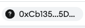

# Uniswap 
https://app.uniswap.org/

## Core Task 01

*Proceed to connect wallet to website with a practical mental model (G1-G3) of what connecting means, why the process is what it is (different web3 apps might use different processes), understanding and avoiding risks (G4-G5), and confirming connection is successful (G3) (via the website and via MetaMask).*

* Connect is prominent button on top right of Uniswap page (seems to be typical location across web3 DApps)
* MetaMask shows permissions screen
  * "See your accounts and suggest transactions"
    * Good on jargon (G6)
  * "Use your enabled networks"
    * Linea mainnet (product of ConsenSys, the parent of MetaMask), cannot be removed
    * Not good on jargon (G6)
  * "Only connect with sites you trust"
    * Learn more has a very long [website document](https://support.metamask.io/third-party-platforms-and-dapps/user-guide-dapps/)
* Post-connect, visual cue in top-right is user profile picture (for me)

## Core Task 02

*Configure wallet to connect to a desired blockchain network (if it is not already on this network). This network has to be supported by the DApp to perform transactions. The supported networks may be different on each DApp.* 

* DApp does not have a network choice setting, however the individual actions (such as swap) allows you to select coins on networks you have not configured
* Example, it can see my ETH on OP balance even though OP is not in MetaMask
* Allow this network
  * Shows the logo of current network at top which at a glance seems like you might want to connect to this network (for example, if on Arbitrum One wanting to add Optimism it shows Arbitrum One logo) (G5)
  * 
  * Scam warning is too long under "learn more", should have a short recap (e.g., Not all networks are safe)
  * Expert level configuration screen, typical users can maybe verify URL only

## Core Task 03

*Conduct an operation of the web3 site that does require wallet approval, configure and sign the transaction, understand and avoid risks. Covers token balances, gas fees, approvals, signature, confirming transaction, etc.*

* Complex dialogue with 6 sub panes within the dialogue
  * 1. Network represented as name and logo
    2. Source and destination represented as address snippet
       * Snippet is first 5 hex characters followed by 5th and 4th last characters
       * Stretching changes this
       * ENS is supported
       * Uniswap address is unknown
    3. Domain name with different cue than before
    4. "Contract address: Execute" Redundant with above, unclear what Execute means
    5. Icon for destination with balances of source
       * does not match with 2 (which has question mark) and not clear that it is supposed to be destination rather than source for example
       * 
       * Also shows balance information of source beside cues for destination
       *  
       * 
    6. Details: Estimated changes
       * MetaMask aware of Uniswap and shows custom interface
    7. Estimated fees
       * Gas dioluge 
         * Estimated fee is ETH and USD
         * Max fee only in ETH
         * ETH amounts are tiny (gwei better?), for example is Max and Estimate the same (count the 0's)
         * 
    8. Sign or not

​	

## Core Task 04

*Revert, to the extent possible, any past interactions with the DApp. Disconnect the wallet, unapprove tokens, etc.* 

* Click on user icon top right
* Disconnect is under by "power" icon in top right
* Clicking power icon displays disconnect
* Post-disconnect, top right displays "connect" again

