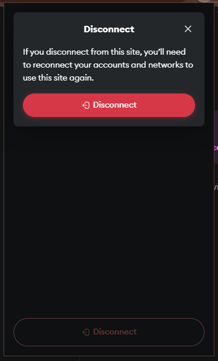

# Uniswap 
https://app.uniswap.org/

 T1. Proceed to connect wallet to website with a practical mental model (G1-G3) of what connecting means, why the process is what it is (different web3 apps might use different processes), understanding and avoiding risks (G4-G5), and confirming connection is successful (G3) (via the website and via MetaMask).

- prompt asks for a permission to "use your enabled networks". It's not clear how the site can "use" the networks (against G8). <b>this applies to all DApps</b>

- prompt warns to "Only connect with sites you trust" and points to a "learn more" link. While the link contains a user guide about DApps, it is dense and difficult to navigate (violating G2). <b>this applies to all DApps</b>

- after connecting, the wallet only includes a small icon of the DApp and shows the site name in a secondary prompt, hurting G3. <b>this applies to all DApps</b>

T2. Configure wallet to connect to a desired blockchain network (start from mainnet Ethereum). This network has to be supported by the DApp to perform transactions. The supported networks may be different on each DApp.

- (T2 prompt during T3) wallet only shows "this site" when prompting to add a network. This may be an attacker-in-the-middle in an attempt to get the user on a malicious network (G5). 

- Difficult to determine how to change network from the site. Option is nested in a tertiary prompt, slightly violating G1. Selecting a network on the site triggers a very short-lived textbox that says "Swapping on <network>", however it's unclear if this changed the network on the wallet, affecting G6-G8.

(from wallet)
- Selecting a pre-configured network on the wallet warns that MetaMask does not verify the network. The warning points to a user guide which is not easy to understand, thus the security and privacy implications may not be understood (G5). <b>this applies to all DApps</b>

- For adding other networks, the "add a custom network" option prompts the user to enter technical details about the network without any guidance, violating G2. <b>this applies to all DApps</b>

T3. Conduct an operation of the web3 site that does require wallet approval, configure and sign the transaction, understand and avoid risks. Covers token balances, gas fees, approvals, signature, confirming transaction, etc.

- Inconsistent warning cues when selecting a token. For example,searching for "usdt" returns three results. Only one entry includes a warning icon, however selecting two of the entries result in the same warning message. Selecting a malicious token can result in loss of assets (G5).

- Wallet prompt includes a small icon beside the contract address with a generic warning to verify before trusting the contract, but gives no information about how to verify (G2). <b>this applies to all DApps</b>

- Wallet prompt includes predictions about the resulting balance changes, but it is not guaranteed as indicated by the text within an icon. This may result in some users placing more trust in the contract than implied by the wallet (G5). <b>this applies to all DApps</b>

- Wallet prompt includes estimated gas fees along with an option to set a limit on the max fee. This option (in a secondary prompt) lists four choices with different limits. Selecting "low" fee may fail (e.g., when the network is busy) which the wallet notifies but without any description of the issue. An external link from the wallet contains ambiguous error message with no recovery instructions (G4). <b>this applies to all DApps</b>

T4. Revert, to the extent possible, any past interactions with the DApp. Disconnect the wallet, unapprove tokens, etc. 

- No option on DApp to view/revoke token approvals (authorized on its site) when disconnecting it from the wallet. <b>Users may expect approvals to be given to DApp (as opposed to contracts) and hence assume incorrectly that disconnect would also remove these permissions.</b>

- No option on wallet to view/revoke token approvals when disconnecting the DApp from the wallet. This option is difficult to find as the user needs to navigate to their profile in MetaMask website and find the contract under the "Spending Caps" tab. This could lead to forgotten approvals (G4-G5). <b>this applies to all DApps</b>

## Screenshots
### Connect wallet permissions

### add network

### searching token

### verify contract & failed trx (low fees)

### Spending cap

### disconnect/revoke

