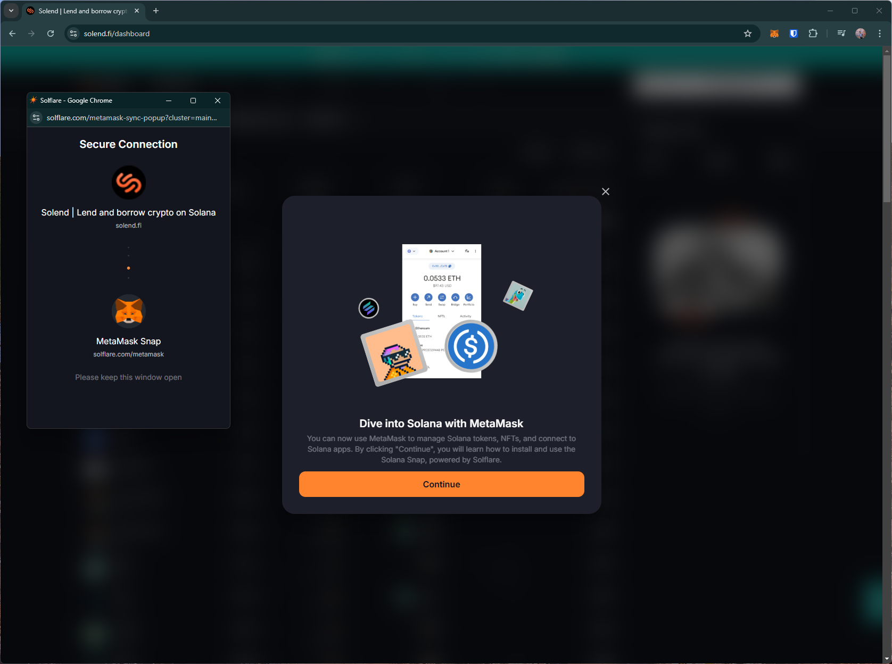
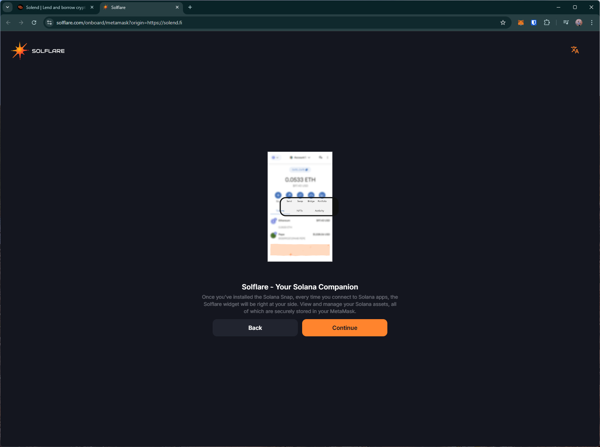
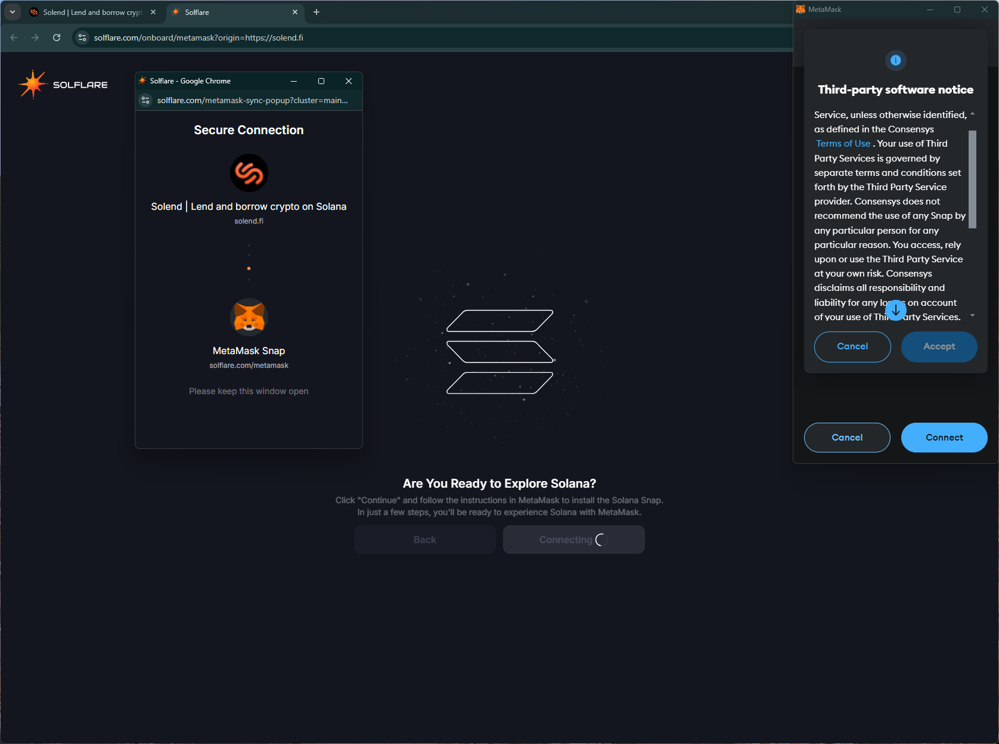
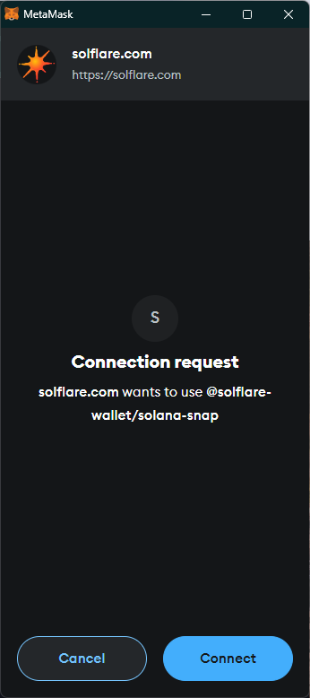
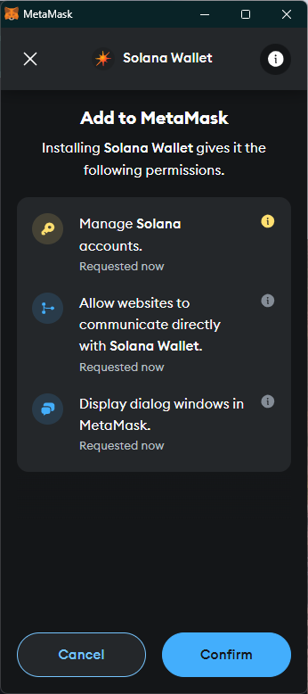
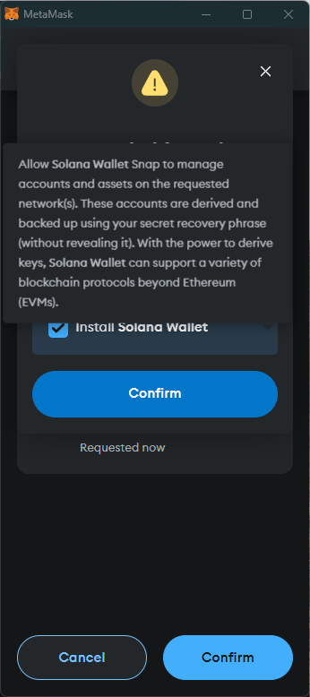
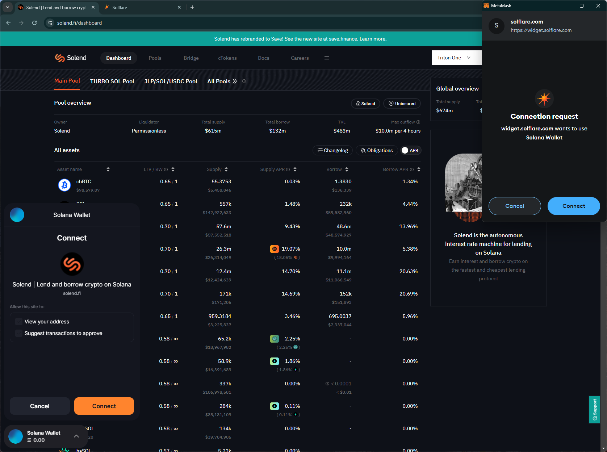
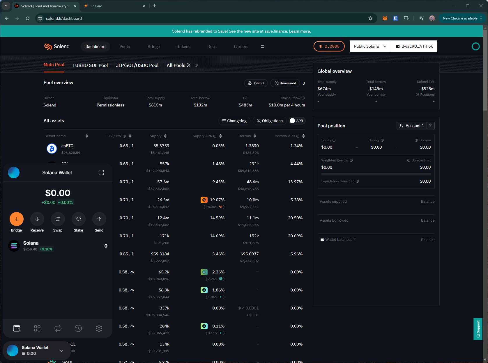
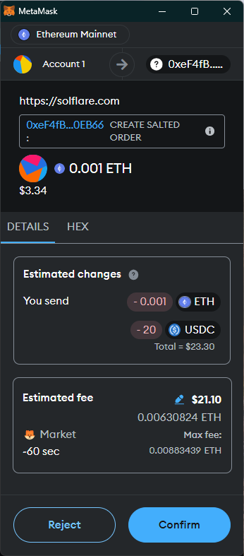

# solend
# https://solend.fi/

T1. Proceed to connect wallet to website with a practical mental model (G1-G3) of what connecting means, why the process is what it is (different web3 apps might use different processes), understanding and avoiding risks (G4-G5), and confirming connection is successful (G3) (via the website and via MetaMask).

- Connecting wallet opens a popup window with a different website (`solflare.com`). Following the instructions leads MetaMask to prompt the user to agree to the use of third-party `snap` service and provide permissions to the snap.
    - Snaps are third-party add-on services installed in the wallet.
    - the snap first asks permission to communicate with a second wallet, then prompts the user to install `Solana Wallet`.  
    - This complicated flow does not provide sufficient information about the options available to users, e.g., do I have to use the snap?
    - After connecting, the new Solana wallet is embedded within the site. This workflow involving two wallets deviates from what users expect on other common dapps, hurting learnability (G1-G3) and comprehensibility (G6-G8).

T2. Configure wallet to connect to a desired blockchain network (start from mainnet Ethereum). This network has to be supported by the DApp to perform transactions. The supported networks may be different on each DApp.

- Users seeing the option on the site to select network might expect this to change the network on their 'main' MetaMask wallet, however this relates to the new Solana Wallet.

T3. Conduct an operation of the web3 site that does require wallet approval, configure and sign the transaction, understand and avoid risks. Covers token balances, gas fees, approvals, signature, confirming transaction, etc.

- Initiating a bridge transaction on Solend opens the second website (solflare), which may be unexpected for users (G6-G7).
    - Asks for unlimited approval.
    - MetaMask only shows expected send amount.

T4. Revert, to the extent possible, any past interactions with the DApp. Disconnect the wallet, unapprove tokens, etc. 

- Disconnect option on the site disconnects the Solana wallet and not MetaMask, which might be confusing for users.

## Screenshots
### connect wallet

### transaction

