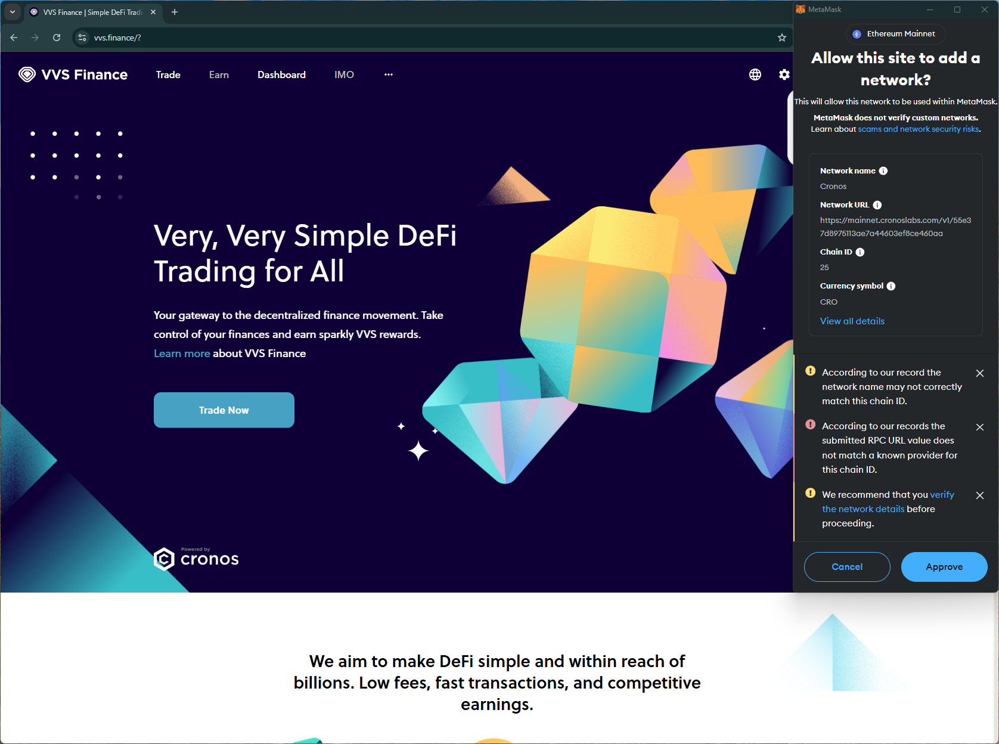
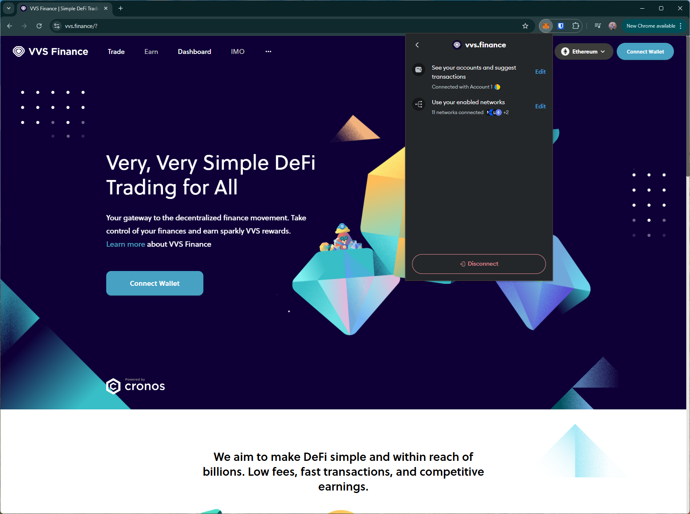

# vvs
https://vvs.finance/

## Core Task 01

*Proceed to connect wallet to website with a practical mental model (G1-G3) of what connecting means, why the process is what it is (different web3 apps might use different processes), understanding and avoiding risks (G4-G5), and confirming connection is successful (G3) (via the website and via MetaMask).*

- Visiting the landing page automatically triggers connection request in the wallet. This may not be preferred, e.g., if a user has multiple wallets, they might want to choose their preferred wallet for the site.

## Core Task 02

*Configure wallet to connect to a desired blockchain network (if it is not already on this network). This network has to be supported by the DApp to perform transactions. The supported networks may be different on each DApp.* 

- Simple dropdown prompt on the site to choose a supported network.

- Multiple warnings about unknown RPC provider, network name and chain ID.

## Core Task 03

*Conduct an operation of the web3 site that does require wallet approval, configure and sign the transaction, understand and avoid risks. Covers token balances, gas fees, approvals, signature, confirming transaction, etc.*

- Asks for unlimited approval.

- shows a short confirmation notification after the transaction succeeds, and updates the balance on the page.

## Core Task 04

*Revert, to the extent possible, any past interactions with the DApp. Disconnect the wallet, unapprove tokens, etc.* 

- Disconnect option doesn't disconnect site from the wallet (i.e., can reopen site and connect wallet without approving in the wallet)

## Screenshots
### add network warning

### disconnect doesn't remove the site from the wallet

