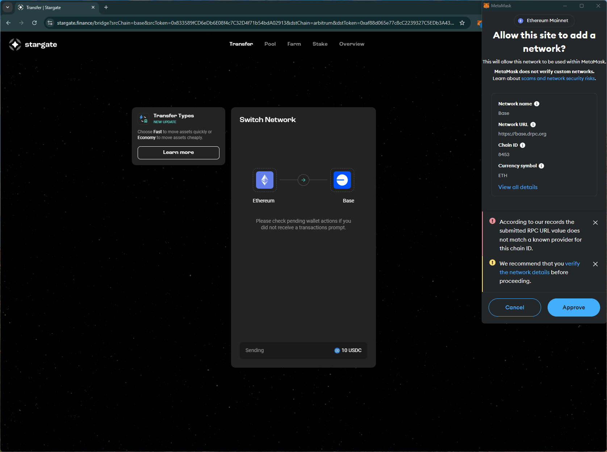
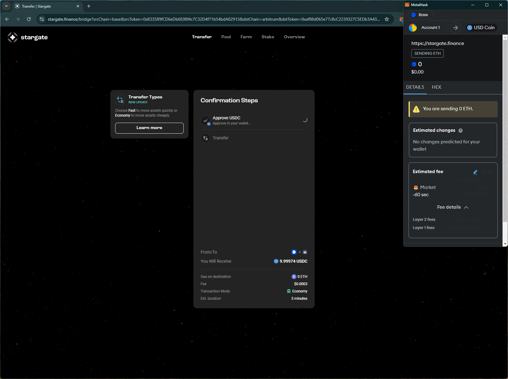
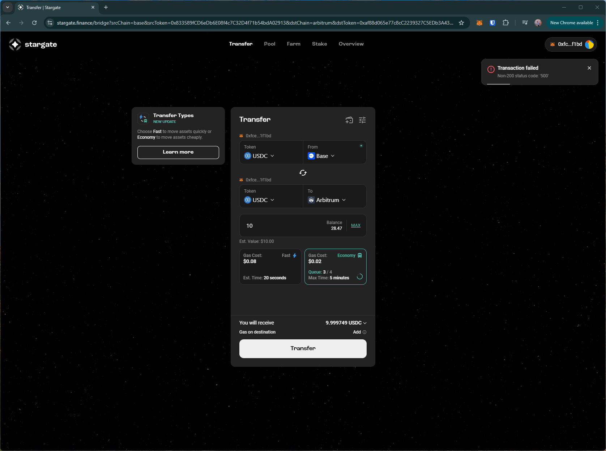
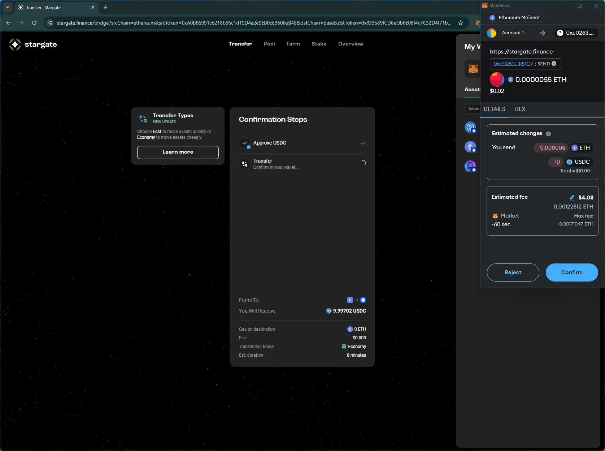

# stargate
# https://stargate.finance/

T1. Proceed to connect wallet to website with a practical mental model (G1-G3) of what connecting means, why the process is what it is (different web3 apps might use different processes), understanding and avoiding risks (G4-G5), and confirming connection is successful (G3) (via the website and via MetaMask).

- Connect wallet option is simple. Shows the (partial) wallet address and the balances after connection is successful.

T2. Configure wallet to connect to a desired blockchain network (start from mainnet Ethereum). This network has to be supported by the DApp to perform transactions. The supported networks may be different on each DApp.

- (merged with T3) No explicit option to change network without initiating a transaction.
    - Changing to Base raises MetaMask prompt with warning about unknown RPC provider. This is unhelpful without further instructions. One option for the wallet is to suggest alternative RPCs, e.g., used by the user in a previous request, or the default RPC used by the wallet. 

T3. Conduct an operation of the web3 site that does require wallet approval, configure and sign the transaction, understand and avoid risks. Covers token balances, gas fees, approvals, signature, confirming transaction, etc.

- The site offers cross-chain transfers. Transferring USDC from Base to Arbitrum results in trx failure, with a vague error message and without remediation instructions.
    - retrying the trx with a different amount reveals that the issue was low ETH balance for paying gas fees. Suggesting this earlier would help users identify and recover (G4).

- Asks for unlimited approval.

- Wallet predictions only shows send amount.

- Shows estimated time for the transaction to complete (supporting G8).

T4. Revert, to the extent possible, any past interactions with the DApp. Disconnect the wallet, unapprove tokens, etc. 

- Disconnect option doesn't disconnect site from the wallet (i.e., can reopen site and connect wallet without approving in the wallet)

## Screenshots
### change to Base prompt

### trx failed without info

### predicted changes

