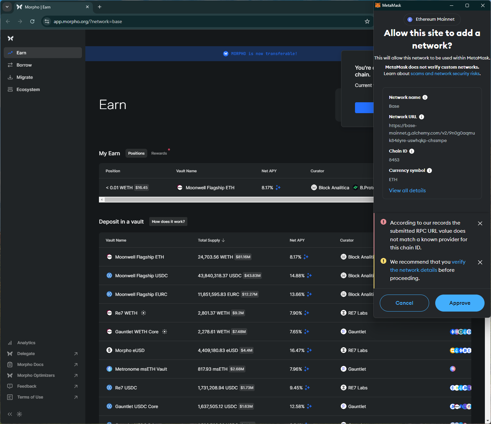

# morpho
https://app.morpho.org/

## Core Task 01

*Proceed to connect wallet to website with a practical mental model (G1-G3) of what connecting means, why the process is what it is (different web3 apps might use different processes), understanding and avoiding risks (G4-G5), and confirming connection is successful (G3) (via the website and via MetaMask).*

- Connect wallet option is simple. Shows user name tag.

## Core Task 02

*Configure wallet to connect to a desired blockchain network (if it is not already on this network). This network has to be supported by the DApp to perform transactions. The supported networks may be different on each DApp.* 

- Simple popup prompt on the site to choose a supported network.

- Adding Base network from site triggers wallet warning as the site specified URL is different.
    - Approving the network raises an error with vague message `Error while connecting to the custom network`, with no information/instructions to proceed (violates G2, G4).
    - Here, the wallet could help by showing its default URL or URLs used/trusted by the user in previous prompts.

## Core Task 03

*Conduct an operation of the web3 site that does require wallet approval, configure and sign the transaction, understand and avoid risks. Covers token balances, gas fees, approvals, signature, confirming transaction, etc.*

- Shows a temporary message with trx confirmation.

## Core Task 04

*Revert, to the extent possible, any past interactions with the DApp. Disconnect the wallet, unapprove tokens, etc.* 

- Disconnect option doesn't disconnect site from the wallet (i.e., can reopen site and connect wallet without approving in the wallet)

## Screenshots
### add network

### trx prompt

### disconnect doesn't remove the site from the wallet

