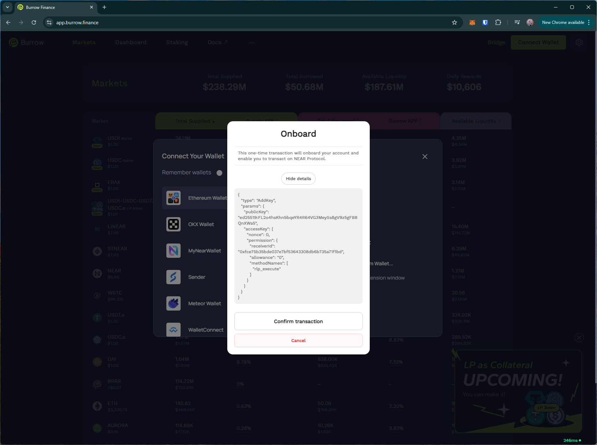
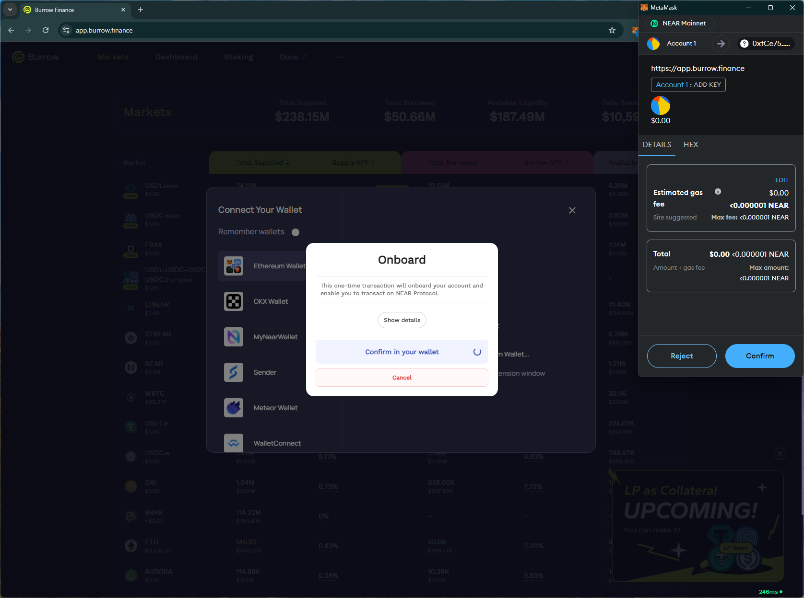
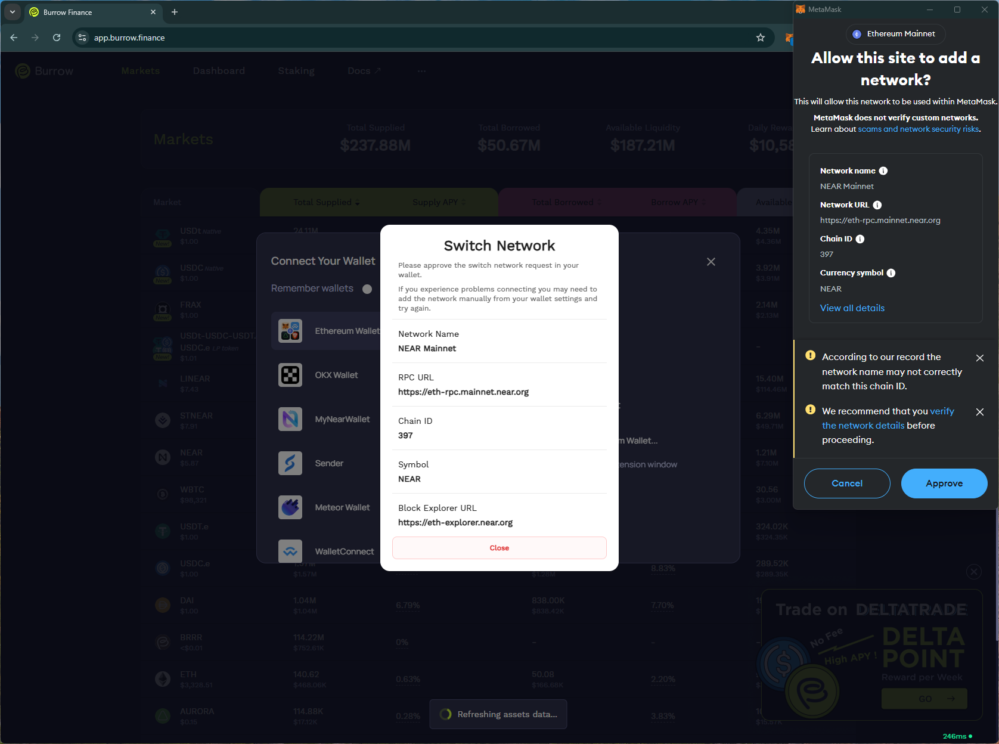

# burrow
# https://app.burrow.finance/

T1. Proceed to connect wallet to website with a practical mental model (G1-G3) of what connecting means, why the process is what it is (different web3 apps might use different processes), understanding and avoiding risks (G4-G5), and confirming connection is successful (G3) (via the website and via MetaMask).

- Connect wallet option involves several steps: usual wallet prompt, add network req, `onboard` transaction signing involving gas fees. Unclear if the site can be used without all these steps (G6-G7)

T2. Configure wallet to connect to a desired blockchain network (start from mainnet Ethereum). This network has to be supported by the DApp to perform transactions. The supported networks may be different on each DApp.

- (T2 merged with T1) Prompts to add network immediately after connecting wallet. Network info in the prompt is duplicated in the site page.

- Unclear if the site only supports NEAR chain as there is no option to change network on the site (G1).

T3. Conduct an operation of the web3 site that does require wallet approval, configure and sign the transaction, understand and avoid risks. Covers token balances, gas fees, approvals, signature, confirming transaction, etc.

- Requires `NEAR` tokens to transact.

T4. Revert, to the extent possible, any past interactions with the DApp. Disconnect the wallet, unapprove tokens, etc. 

- Disconnect option is simple and removes the site from the wallet

## Screenshots
### connect wallet

### add network

