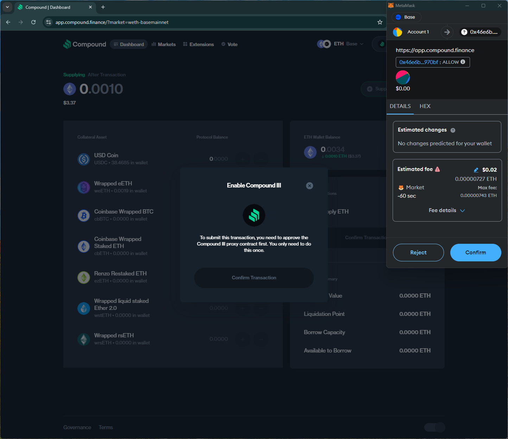

# compound
# https://app.compound.finance/

T1. Proceed to connect wallet to website with a practical mental model (G1-G3) of what connecting means, why the process is what it is (different web3 apps might use different processes), understanding and avoiding risks (G4-G5), and confirming connection is successful (G3) (via the website and via MetaMask).

- Connect wallet option is simple. Shows the (partial) wallet address and the balance after connection is successful.

T2. Configure wallet to connect to a desired blockchain network (start from mainnet Ethereum). This network has to be supported by the DApp to perform transactions. The supported networks may be different on each DApp.

- (T2 merged with T3) no option to add network before initiating a transaction.

T3. Conduct an operation of the web3 site that does require wallet approval, configure and sign the transaction, understand and avoid risks. Covers token balances, gas fees, approvals, signature, confirming transaction, etc.

- Trx is split into a `allow` and a `invoke` contracts. No estimated changes for the first contract.

- Confirm button is disabled preventing the trx from proceeding. No instructions on remediation, violating G2.

- A new trx with a different token asks for unlimited approval.

T4. Revert, to the extent possible, any past interactions with the DApp. Disconnect the wallet, unapprove tokens, etc. 

- Disconnect option doesn't disconnect site from the wallet (i.e., can reopen site and connect wallet without approving in the wallet)

## Screenshots
### add network

### no estimated changes

### disconnect doesn't remove the site from the wallet

