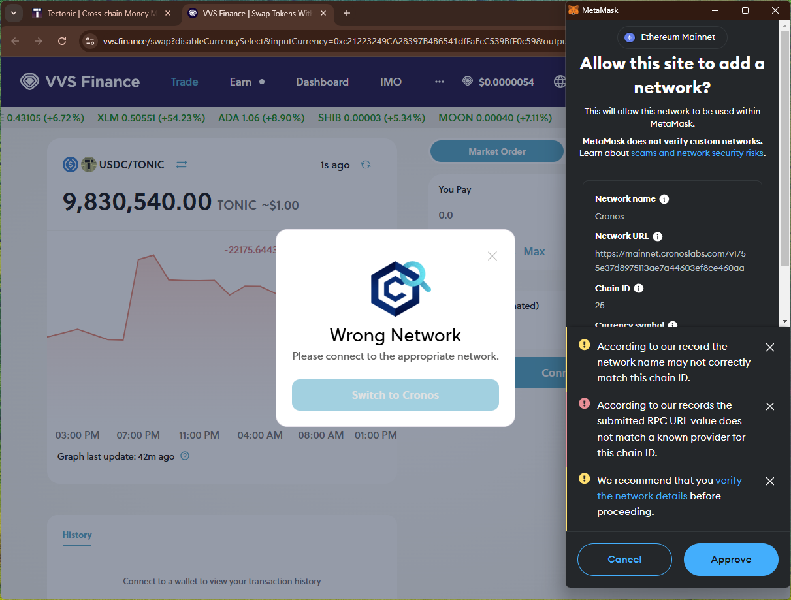
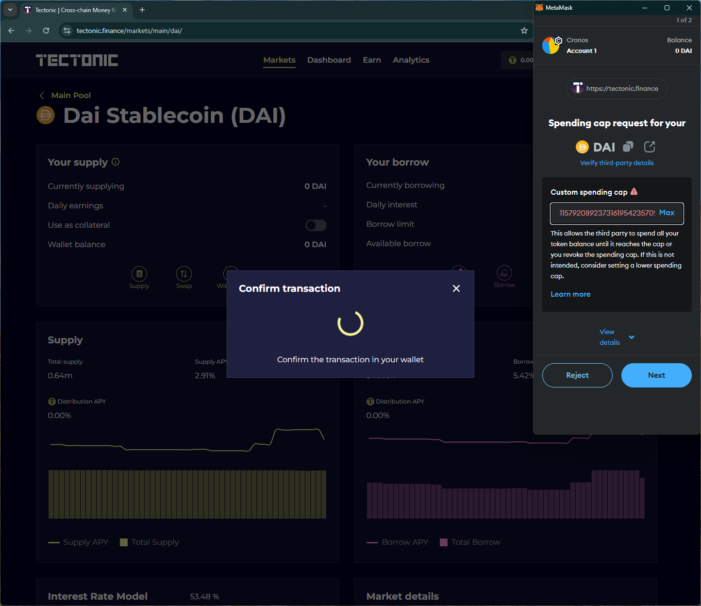
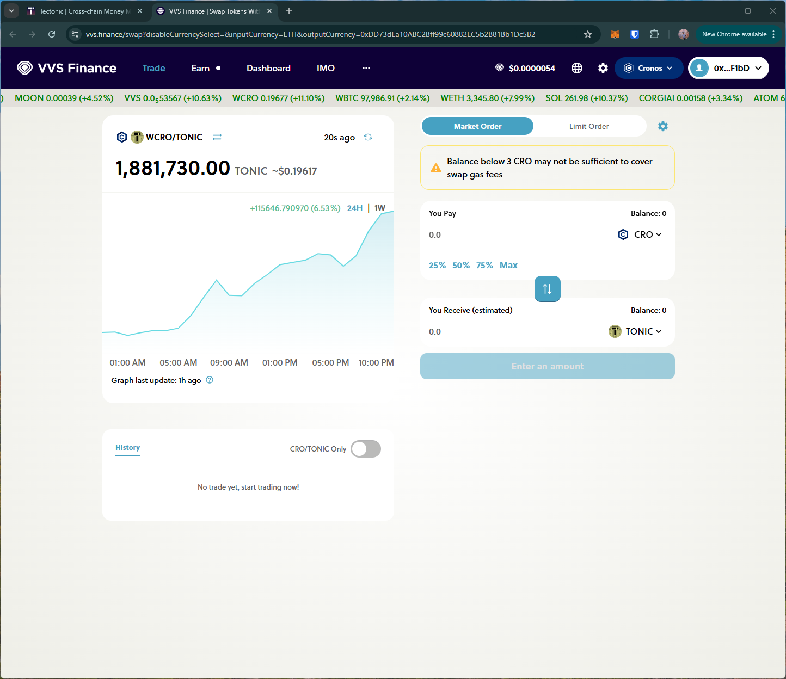
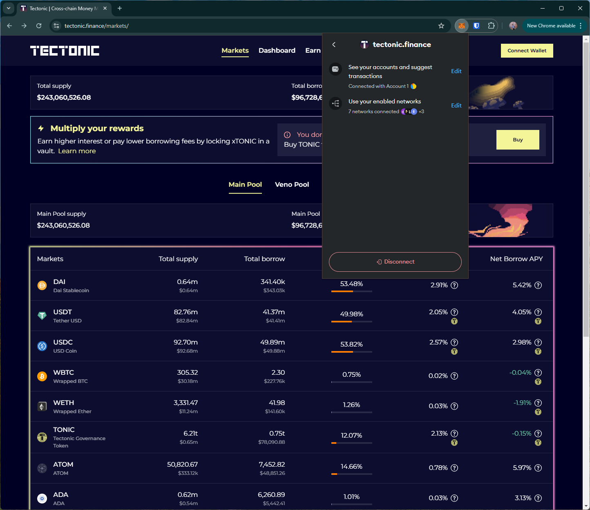

# tectonic
# https://tectonic.finance/

T1. Proceed to connect wallet to website with a practical mental model (G1-G3) of what connecting means, why the process is what it is (different web3 apps might use different processes), understanding and avoiding risks (G4-G5), and confirming connection is successful (G3) (via the website and via MetaMask).

- Connect wallet option is simple. Shows the (partial) wallet address and the balance after connection is successful.

T2. Configure wallet to connect to a desired blockchain network (start from mainnet Ethereum). This network has to be supported by the DApp to perform transactions. The supported networks may be different on each DApp.

- No option to change the network on the dapp to the `Cronos` network specified in the dapp. The `buy` button on the site directs to another site (vvs.finance) which triggers the wallet to add Cronos network.

T3. Conduct an operation of the web3 site that does require wallet approval, configure and sign the transaction, understand and avoid risks. Covers token balances, gas fees, approvals, signature, confirming transaction, etc.

- Asks for unlimited approval

- Need native currency `CRO` to transact. The option to buy CRO on the linked website does not offer a way to buy the token, such as a bridge option (or instructions on buying).

T4. Revert, to the extent possible, any past interactions with the DApp. Disconnect the wallet, unapprove tokens, etc. 

- Disconnect option doesn't disconnect site from the wallet (i.e., can reopen site and connect wallet without approving in the wallet)

## Screenshots
### add network

### trx

### No option to buy Cronos on linked site

### disconnect doesn't remove the site from the wallet

