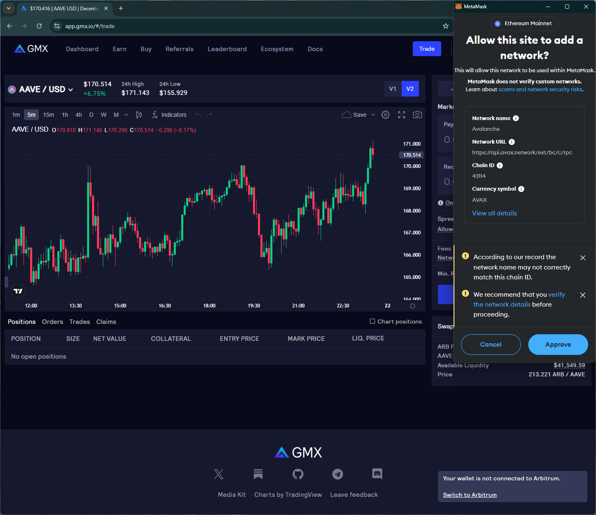
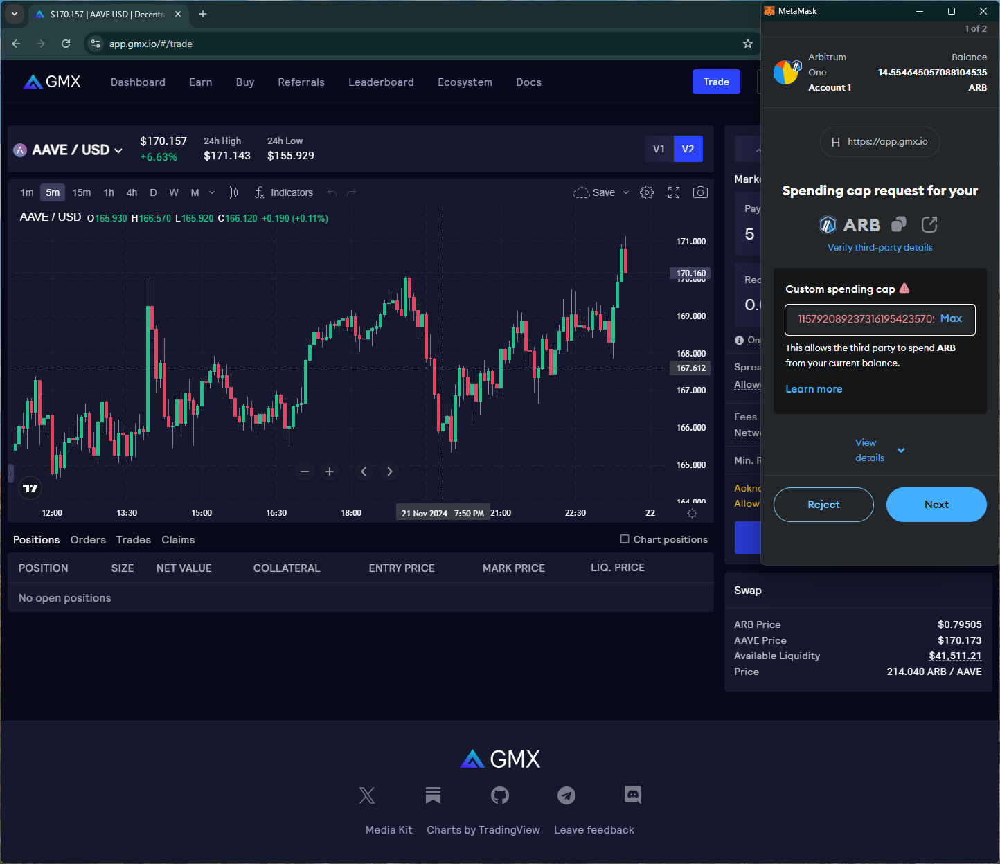
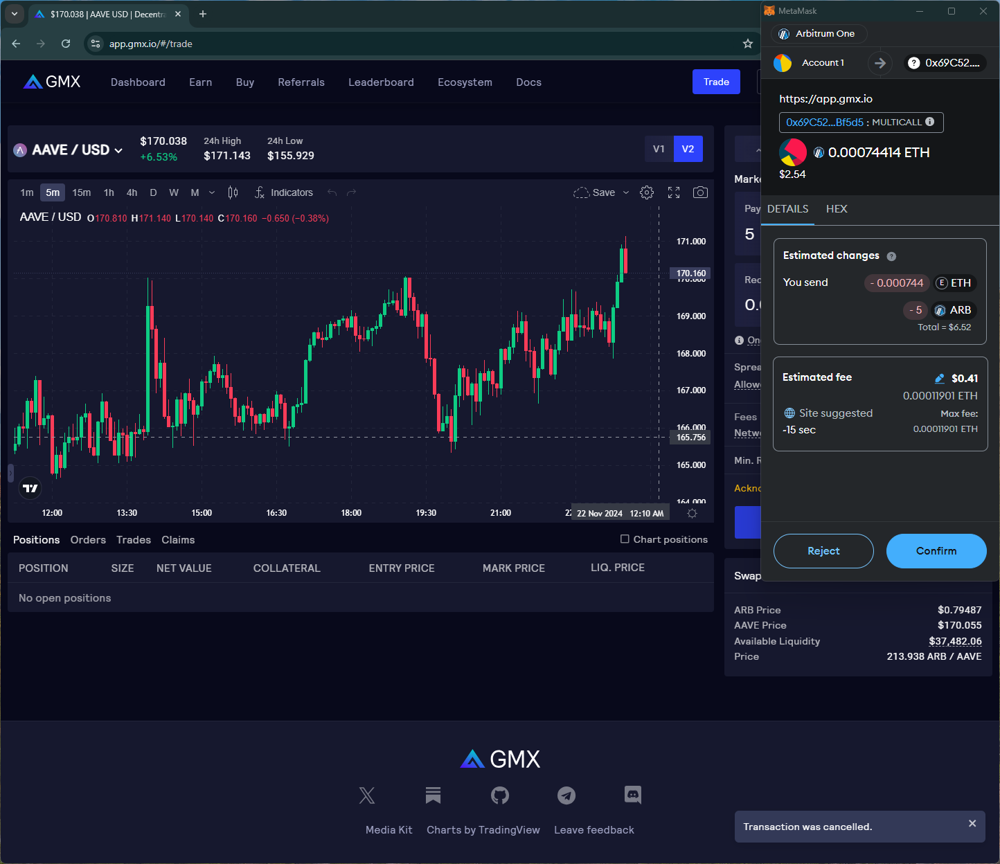
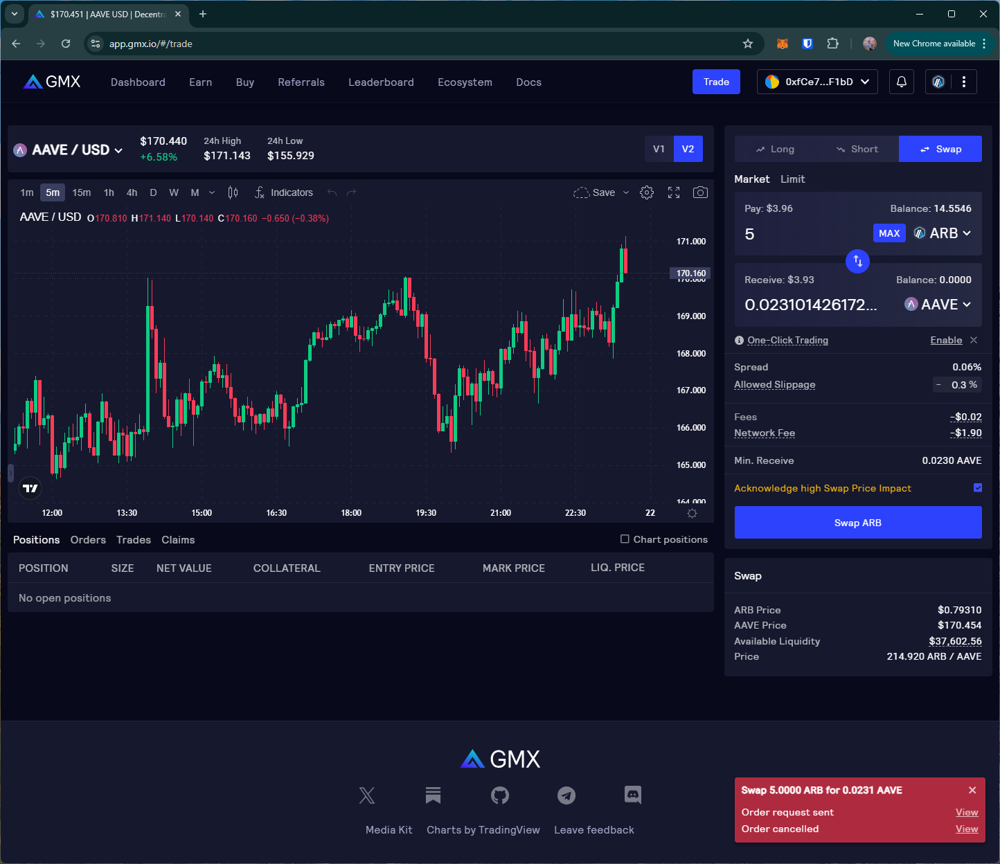
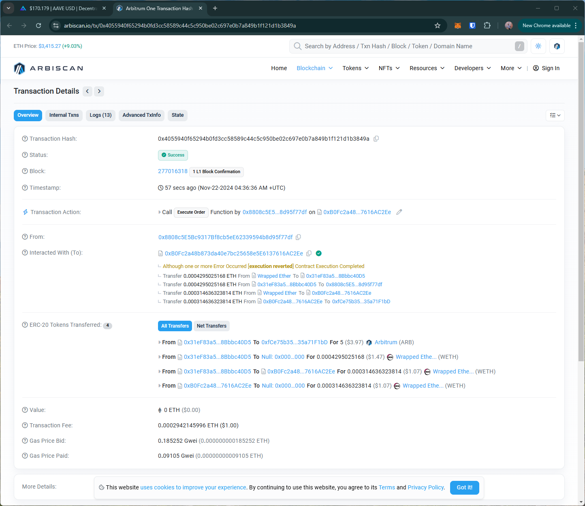
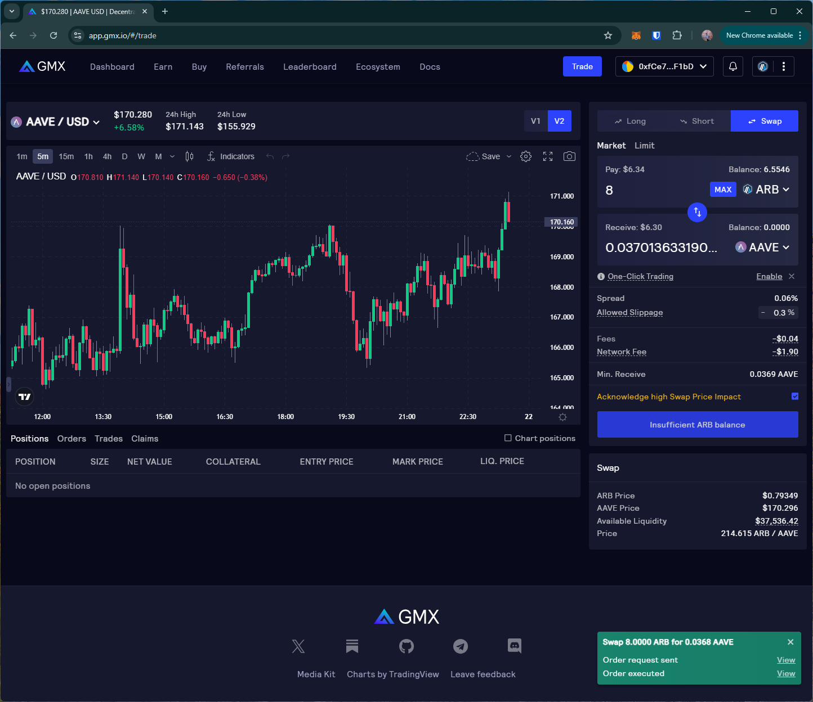

# gmx
# https://app.gmx.io/

T1. Proceed to connect wallet to website with a practical mental model (G1-G3) of what connecting means, why the process is what it is (different web3 apps might use different processes), understanding and avoiding risks (G4-G5), and confirming connection is successful (G3) (via the website and via MetaMask).

- Connect wallet option is simple. Shows the (partial) wallet address after connection is successful.

T2. Configure wallet to connect to a desired blockchain network (start from mainnet Ethereum). This network has to be supported by the DApp to perform transactions. The supported networks may be different on each DApp.

- Simple popup prompt on the site to choose a supported network.

T3. Conduct an operation of the web3 site that does require wallet approval, configure and sign the transaction, understand and avoid risks. Covers token balances, gas fees, approvals, signature, confirming transaction, etc.

- Asks for unlimited approval.

- Only send amount prediction is shown in the wallet prompt.

- trx is marked as successful but it was reverted due to some unspecified error. No info on remediation.
    - Issuing another trx with a higher amount results in successful trx.

T4. Revert, to the extent possible, any past interactions with the DApp. Disconnect the wallet, unapprove tokens, etc. 

- Disconnect option is simple and removes the site from the wallet

## Screenshots
### switch network

### unlimited approval

### predicted changes (only send)

### reverted trx

