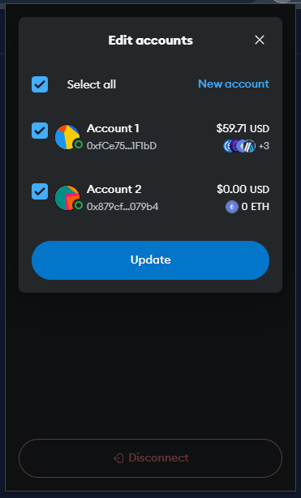

# sushi
https://www.sushi.com/

T1. Proceed to connect wallet to website with a practical mental model (G1-G3) of what connecting means, why the process is what it is (different web3 apps might use different processes), understanding and avoiding risks (G4-G5), and confirming connection is successful (G3) (via the website and via MetaMask).

- Selected multiple addresses on the MetaMask prompt when connecting to the DApp. After connecting, however, only the first address is displayed on the DApp site. Unclear if the other account has also been connected (G3).
    - need to navigate inside MetaMask to confirm the linked accounts.

T2. Configure wallet to connect to a desired blockchain network (start from mainnet Ethereum). This network has to be supported by the DApp to perform transactions. The supported networks may be different on each DApp.

- (T2 prompt during T3) wallet only shows "this site" (G5).

- After configuring the wallet, the DApp confirms the change by highlighting the selected network (aligns with G8).

T3. Conduct an operation of the web3 site that does require wallet approval, configure and sign the transaction, understand and avoid risks. Covers token balances, gas fees, approvals, signature, confirming transaction, etc.

- Selecting a token (e.g., Uniswap) does not show info such as the coin address which may be important for selecting the correct coin (G4-G5). 

- Many legitimate entries in the token search results do not show favicons (e.g., Uniswap coin), which may influence users to pick other (unintended) coins (G4-G5).

- Default spending cap suggested by the DApp is equal to the amount in the transaction, helping prevent unintentional unlimited approvals.

T4. Revert, to the extent possible, any past interactions with the DApp. Disconnect the wallet, unapprove tokens, etc. 

- Disconnect option is simple, but no option to view/revoke token approvals.

## Screenshots
### wallet address on DApp site

### add network

### selecting token

### limited approval
