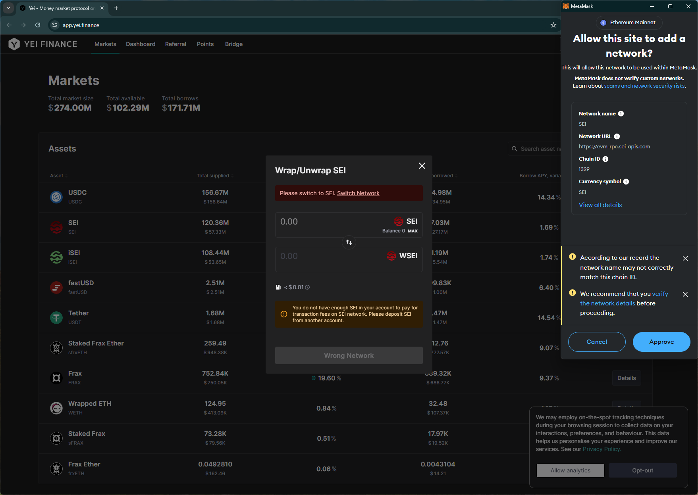
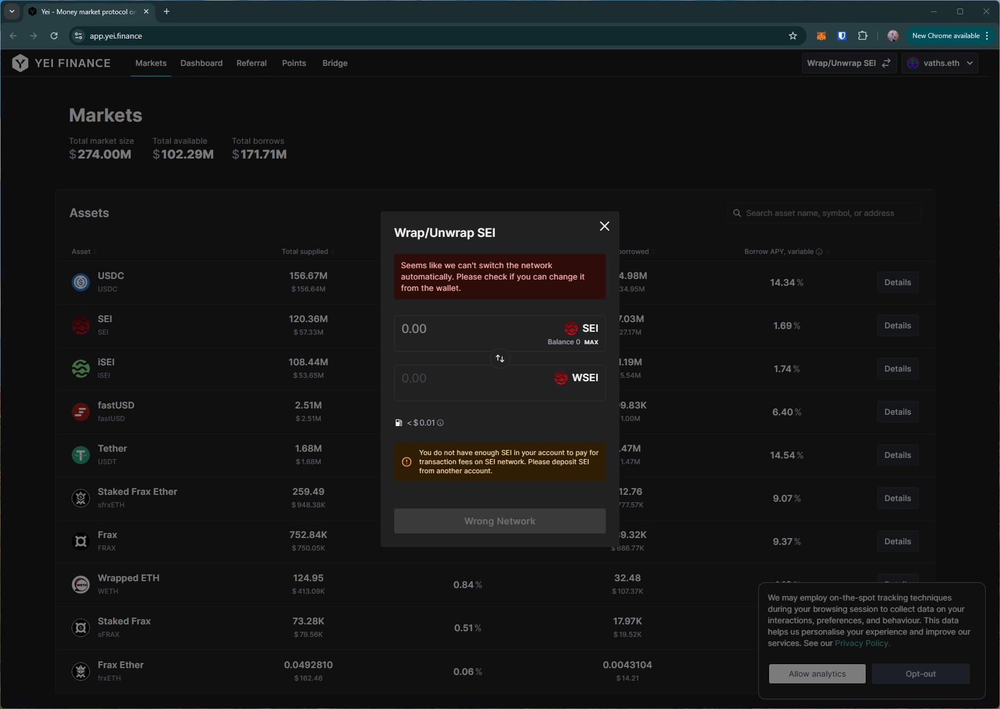
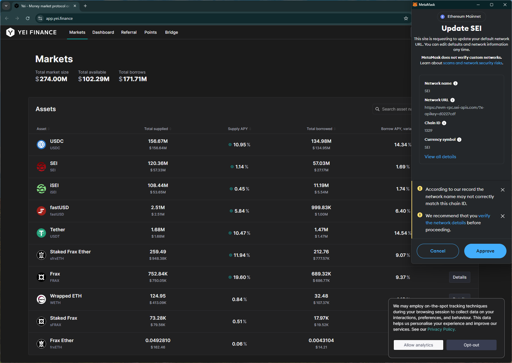
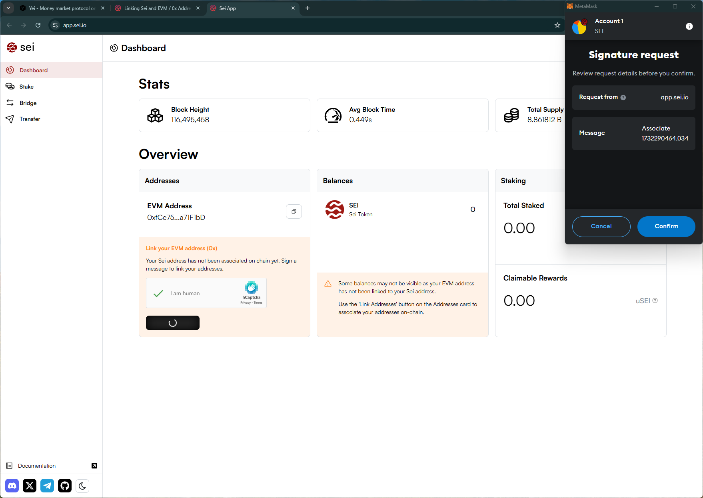
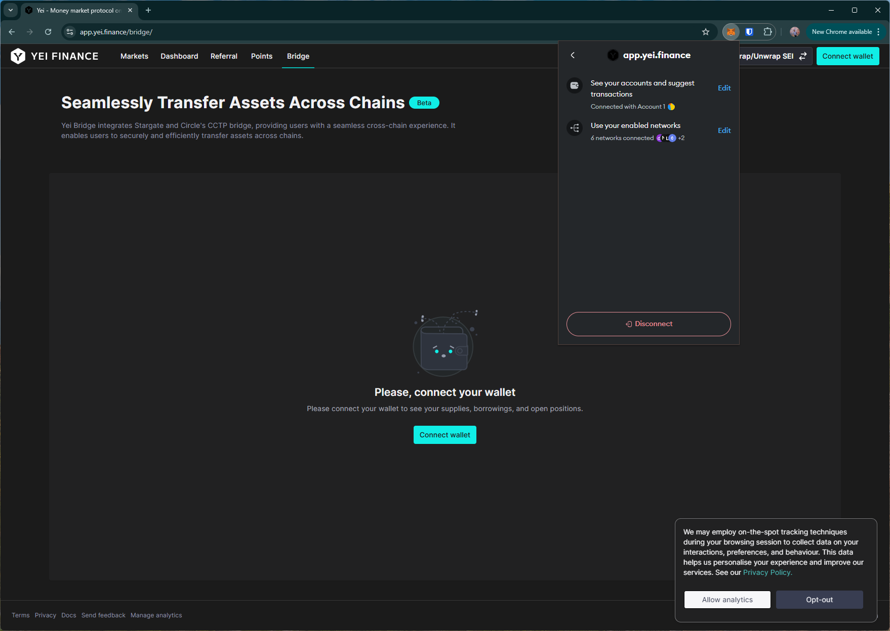

# yei
https://app.yei.finance/

## Core Task 01

*Proceed to connect wallet to website with a practical mental model (G1-G3) of what connecting means, why the process is what it is (different web3 apps might use different processes), understanding and avoiding risks (G4-G5), and confirming connection is successful (G3) (via the website and via MetaMask).*

- Connect wallet option is simple. Confirms by showing the user's name tag.

## Core Task 02

*Configure wallet to connect to a desired blockchain network (if it is not already on this network). This network has to be supported by the DApp to perform transactions. The supported networks may be different on each DApp.* 

- Selecting the `add network` option on the site and approving in the wallet leads to a error. The site suggests changing the network via the wallet.

## Core Task 03

*Conduct an operation of the web3 site that does require wallet approval, configure and sign the transaction, understand and avoid risks. Covers token balances, gas fees, approvals, signature, confirming transaction, etc.*

- Bridging from Base to SEI.        
    - Site asks approval only for the trx amount.
    - Site points to a different site and asks to link `Sei address` to complete trx. This involves connecting the new site to the wallet and signing a message that "associates" with the EVM address. Unclear why this is required

## Core Task 04

*Revert, to the extent possible, any past interactions with the DApp. Disconnect the wallet, unapprove tokens, etc.* 

- Disconnect option doesn't disconnect site from the wallet (i.e., can reopen site and connect wallet without approving in the wallet)

## Screenshots
### add network

### Link `Sei address` to `EVM address`

### disconnect doesn't remove the site from the wallet
