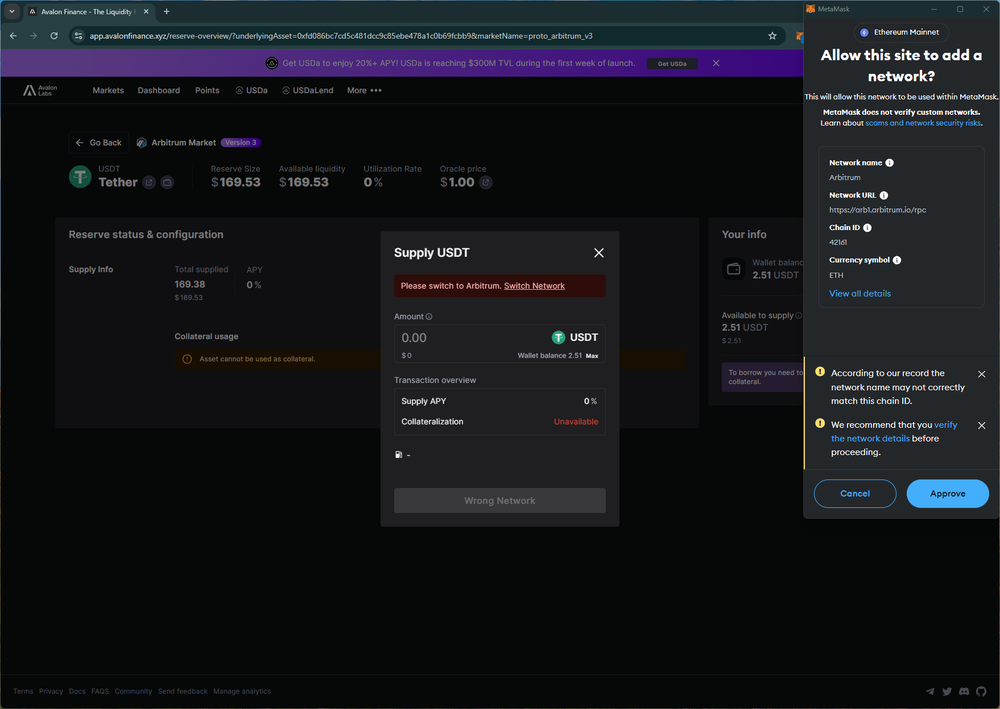
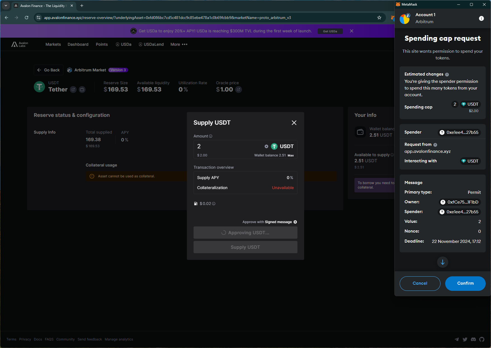
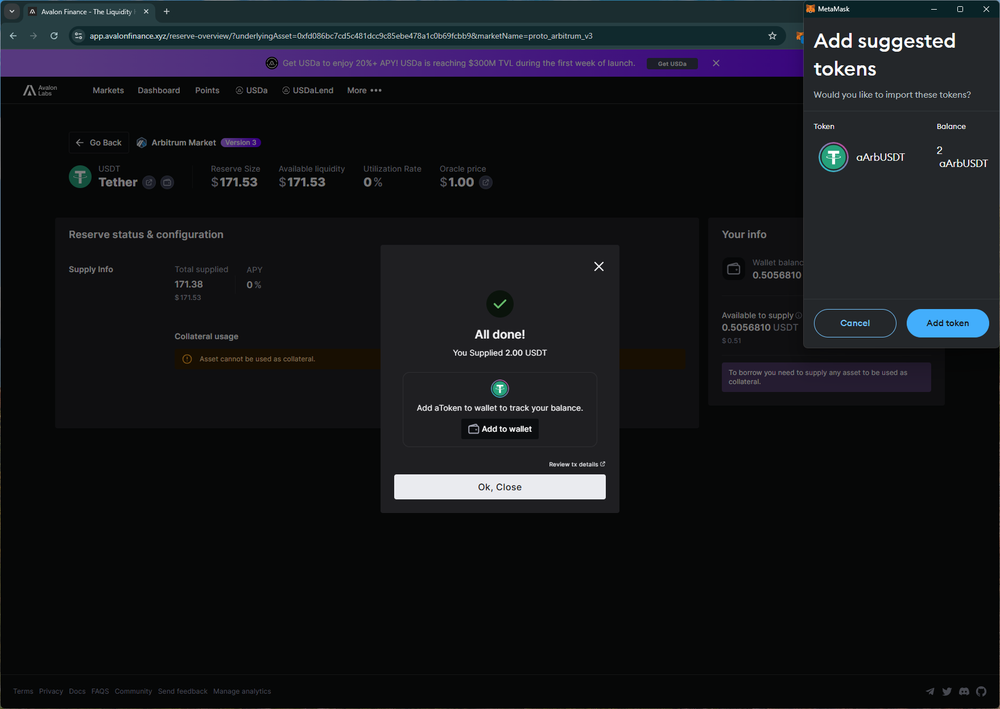
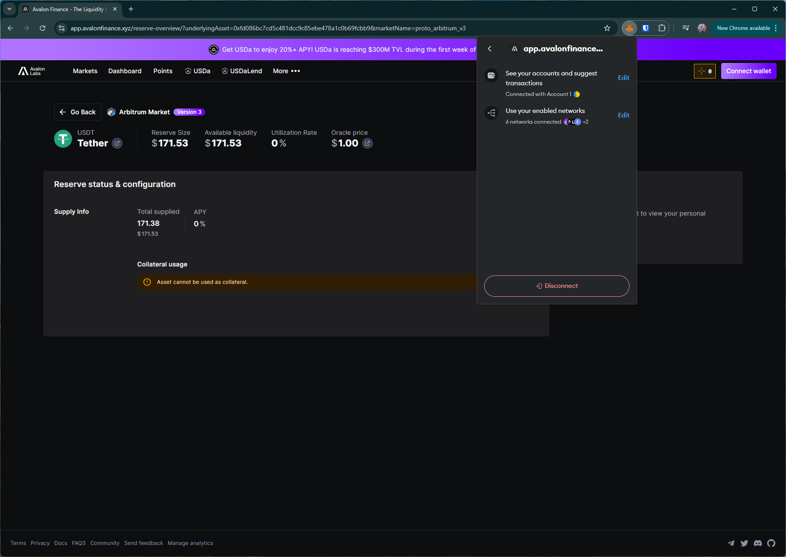

# avalon
# https://app.avalonfinance.xyz/

T1. Proceed to connect wallet to website with a practical mental model (G1-G3) of what connecting means, why the process is what it is (different web3 apps might use different processes), understanding and avoiding risks (G4-G5), and confirming connection is successful (G3) (via the website and via MetaMask).

- Simple option to connect wallet. Shows the user's name tag after connecting.

T2. Configure wallet to connect to a desired blockchain network (start from mainnet Ethereum). This network has to be supported by the DApp to perform transactions. The supported networks may be different on each DApp.

- (T2 merged with T3) Selecting a new network on the site doesn't trigger the wallet. The wallet prompt to switch is only after initiating a transaction.

T3. Conduct an operation of the web3 site that does require wallet approval, configure and sign the transaction, understand and avoid risks. Covers token balances, gas fees, approvals, signature, confirming transaction, etc.

- A different layout is used for the spending cap request in the wallet, including different display of estimated changes, message, requestor/spender info. UI inconsistencies for the same request across different sites affects comprehensibility (G6-G7). 

- Shows trx confirmation and a `add to wallet` option

T4. Revert, to the extent possible, any past interactions with the DApp. Disconnect the wallet, unapprove tokens, etc. 

- 

## Screenshots
### add network

### spending cap request (different layout)

### add to wallet

## disconnect doesn't remove site from the wallet
