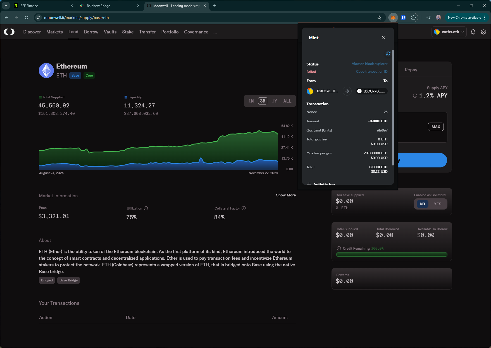

# moonwell
https://moonwell.fi/

## Core Task 01

*Proceed to connect wallet to website with a practical mental model (G1-G3) of what connecting means, why the process is what it is (different web3 apps might use different processes), understanding and avoiding risks (G4-G5), and confirming connection is successful (G3) (via the website and via MetaMask).*

- Simple option to connect wallet. Shows user's name tag and currently connected network as confirmation.

## Core Task 02

*Configure wallet to connect to a desired blockchain network (if it is not already on this network). This network has to be supported by the DApp to perform transactions. The supported networks may be different on each DApp.* 

- Prompts to switch to `Base` in the `lend` transaction page. Selecting this option, the wallet shows warnings as the specified RPC is unknown to the wallet.

## Core Task 03

*Conduct an operation of the web3 site that does require wallet approval, configure and sign the transaction, understand and avoid risks. Covers token balances, gas fees, approvals, signature, confirming transaction, etc.*

- Wallet notifies that the lending trx failed in a very short notification. The wallet doesn't provide info/point to a block scanner for the failure.
    - Increasing the trx amount leads to a successful trx.

## Core Task 04

*Revert, to the extent possible, any past interactions with the DApp. Disconnect the wallet, unapprove tokens, etc.* 

- Disconnect option doesn't disconnect site from the wallet (i.e., can reopen site and connect wallet without approving in the wallet)

## Screenshots
### trx failed error

### disconnect doesn't remove site from the wallet
