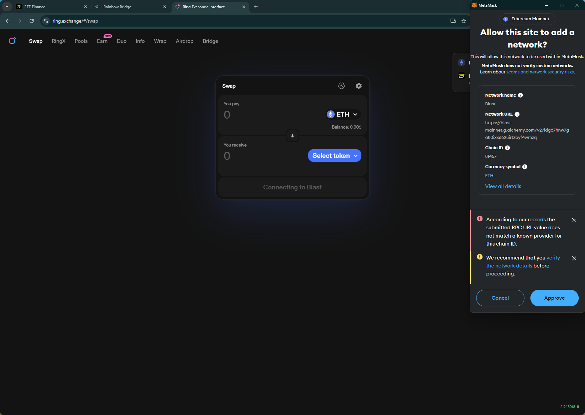
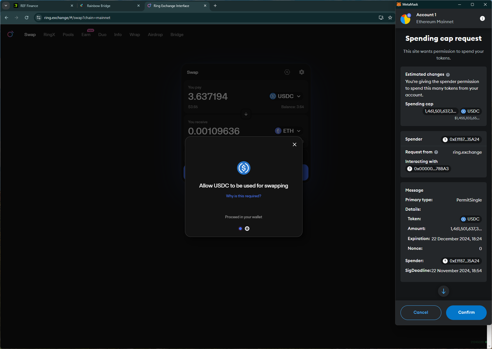
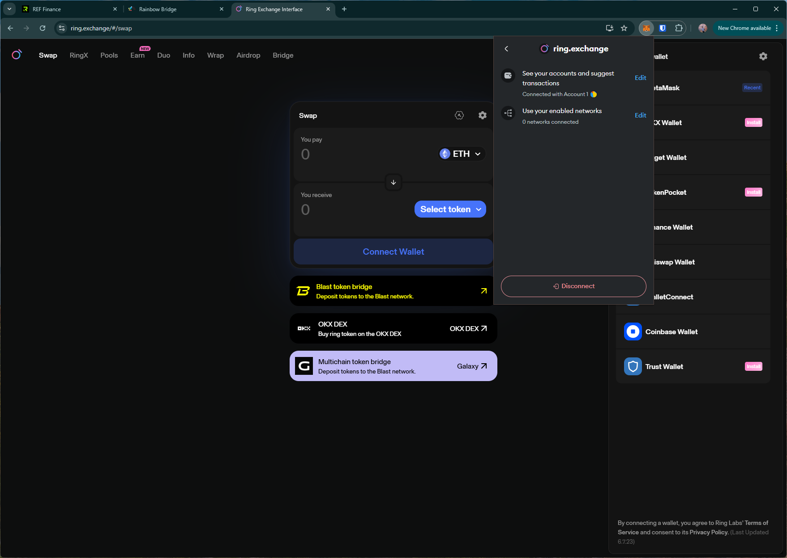

# ring
https://ring.exchange/

## Core Task 01

*Proceed to connect wallet to website with a practical mental model (G1-G3) of what connecting means, why the process is what it is (different web3 apps might use different processes), understanding and avoiding risks (G4-G5), and confirming connection is successful (G3) (via the website and via MetaMask).*

- Simple option to connect wallet. Shows user's tag name and balance as confirmation.

## Core Task 02

*Configure wallet to connect to a desired blockchain network (if it is not already on this network). This network has to be supported by the DApp to perform transactions. The supported networks may be different on each DApp.* 

- switching to `BLAST` network involves an RPC URL unknown to the wallet.
    - This results in an error asking the user to switch directly on the wallet.
    - Though the switch was unsuccessful, the new network is added to the wallet (i.e., user info is possibly already leaked)

## Core Task 03

*Conduct an operation of the web3 site that does require wallet approval, configure and sign the transaction, understand and avoid risks. Covers token balances, gas fees, approvals, signature, confirming transaction, etc.*

- Spending cap request in the wallet uses a new layout (possibly due to newer wallet API)

## Core Task 04

*Revert, to the extent possible, any past interactions with the DApp. Disconnect the wallet, unapprove tokens, etc.* 

- Disconnect option doesn't disconnect site from the wallet (i.e., can reopen site and connect wallet without approving in the wallet)

## Screenshots
### add network 

### spending cap request (new layout)

### disconnect doesn't remove site from the wallet
