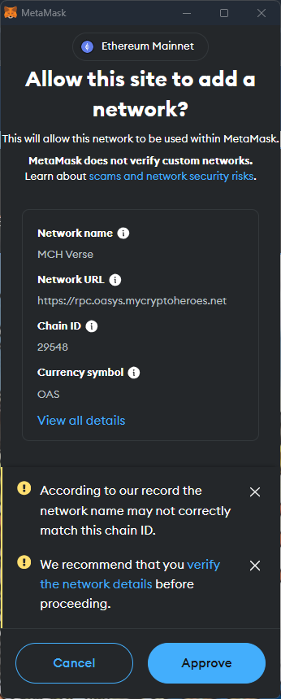
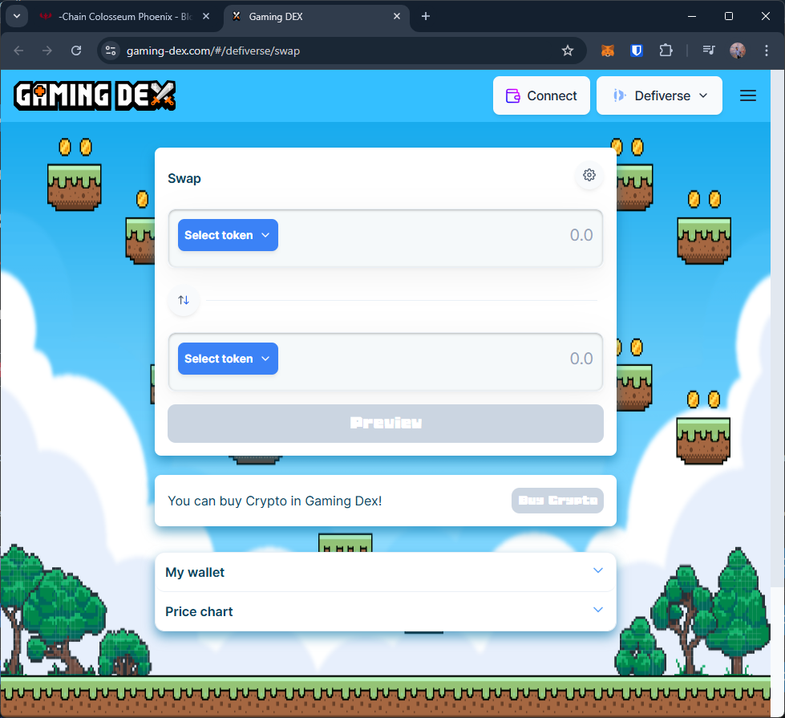
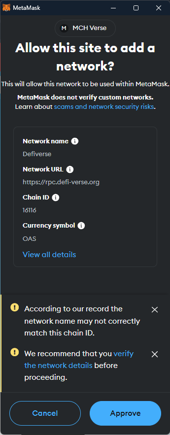
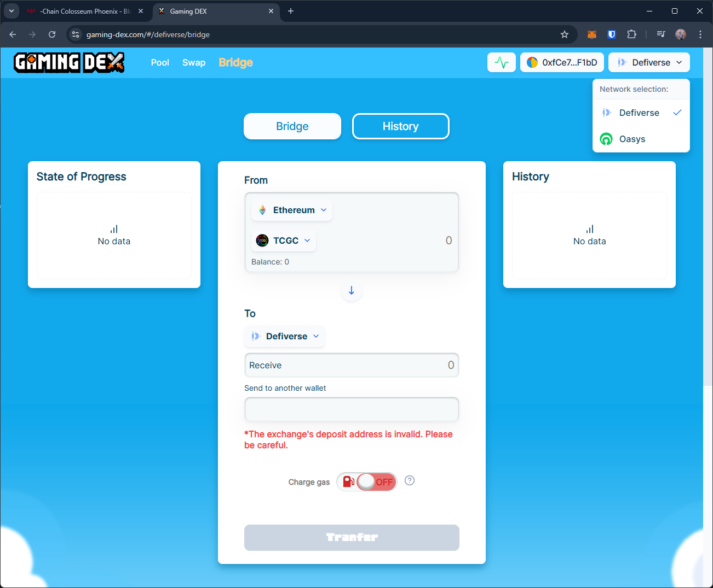
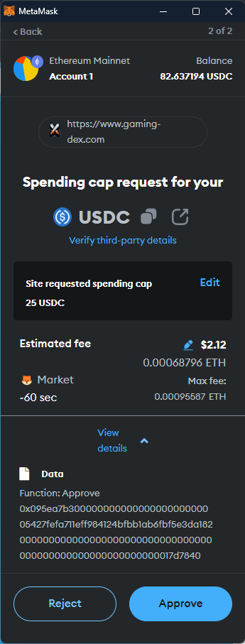
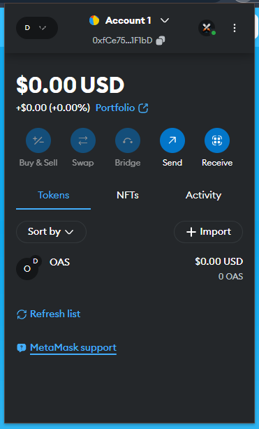
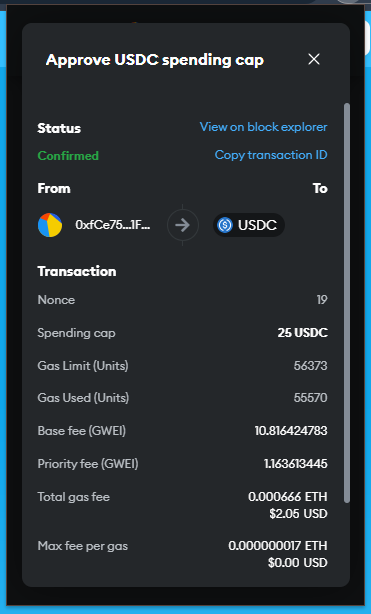
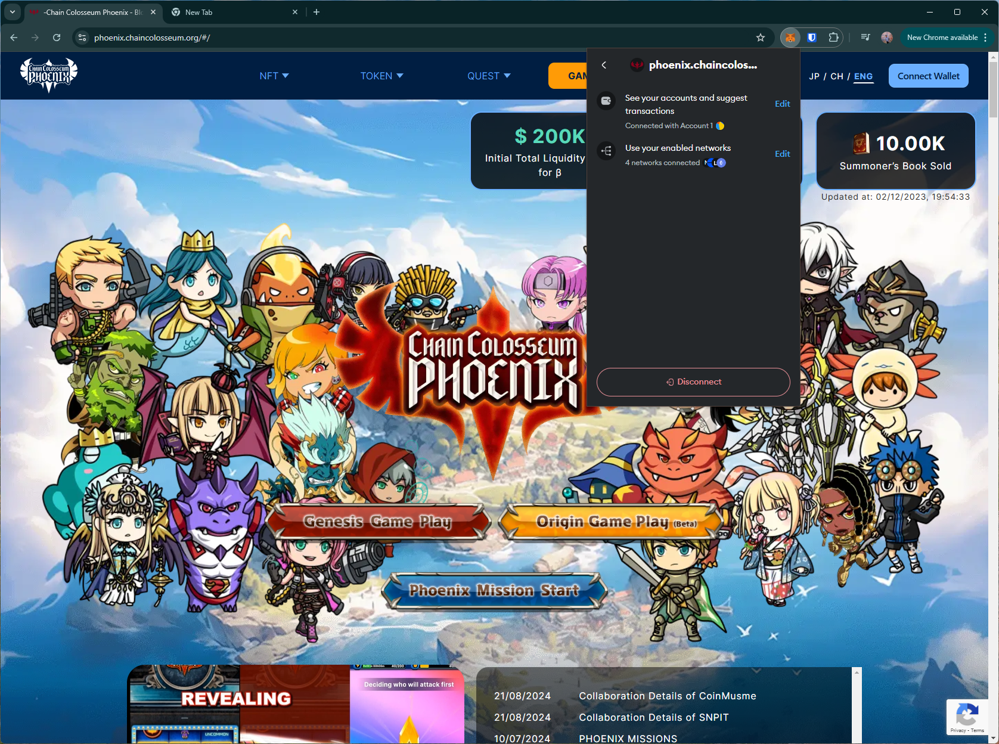

# chain colosseum
https://phoenix.chaincolosseum.org/

T1. Proceed to connect wallet to website with a practical mental model (G1-G3) of what connecting means, why the process is what it is (different web3 apps might use different processes), understanding and avoiding risks (G4-G5), and confirming connection is successful (G3) (via the website and via MetaMask).

- After connecting the wallet, the DApp still shows "Connect wallet" option. It only updates this button after re-clicking the connect wallet option (violates G8).

T2. Configure wallet to connect to a desired blockchain network (start from mainnet Ethereum). This network has to be supported by the DApp to perform transactions. The supported networks may be different on each DApp.

- (T2 prompted during T1) for the custom network requested by the site, the wallet warns that the specified network name may not match the chain ID and points to a MetaMask guide. This guide explains custom network and recommends several steps for verifying the network, including relying on ad-hoc Google searches. Many users may skip reading the guide, and may also authorize connecting to malicious networks (G5)
    - https://support.metamask.io/networks-and-sidechains/managing-networks/verifying-custom-network-information/

T3. Conduct an operation of the web3 site that does require wallet approval, configure and sign the transaction, understand and avoid risks. Covers token balances, gas fees, approvals, signature, confirming transaction, etc.

- DApp option for buying a token navigates to a new website, reprompting the user to connect their wallet. After connecting, the new site requests to connect to a different network (same symbol but different chain ID), with similar warnings as above.
    - Users may add more networks than necessary, increasing the attack space (G5).

- The DApp does not support other networks. If the user does not already own tokens in the new network, they need to perform additional steps to buy (or bridge from another network) new tokens and transact on this network.
    - Users may choose to buy this token on a different Dex platform where they need to first determine if the network is supported for exchange, then ensure the correct network is selected/added.

    - This complicated design involving multiple DApps, multiple networks, and potentially different exchanges, affects learnability (G6-G7) and may lead to errors (G5).

- Using the DApp's exchange for bridge transaction only partially completes, with no status info (G8). Wallet shows that the spending cap request succeeded but the balance remains as zero. This may lead users to retry and perform multiple transaction requests, including spending cap approvals.

T4. Revert, to the extent possible, any past interactions with the DApp. Disconnect the wallet, unapprove tokens, etc. 

- Disconnect option doesn't disconnect site from the wallet (i.e., can reopen site and connect wallet without approving in the wallet)

- Need to disconnect from both DApps.

## Screenshots
### configure network warnings

### buying tokens

### no predicted changes for trx

### trx only partially completed

### disconnect doesn't remove site from wallet

