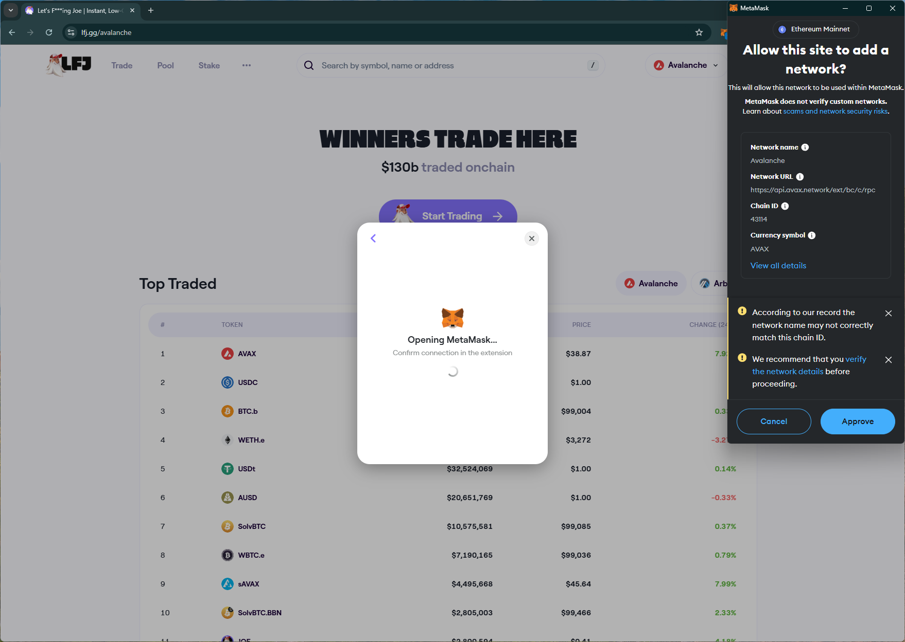
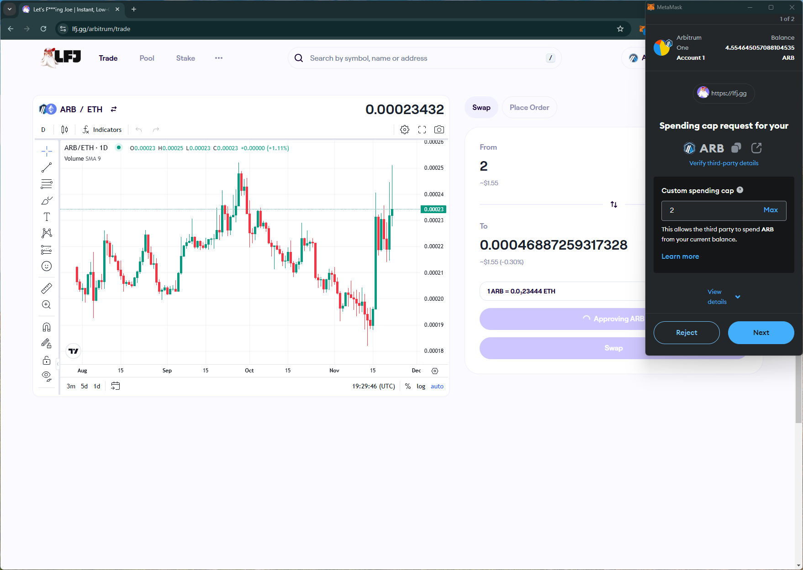

# lfj
https://lfj.gg/

## Core Task 01

*Proceed to connect wallet to website with a practical mental model (G1-G3) of what connecting means, why the process is what it is (different web3 apps might use different processes), understanding and avoiding risks (G4-G5), and confirming connection is successful (G3) (via the website and via MetaMask).*

- Connecting to wallet immediately triggers network switch to `Avalanche`.

## Core Task 02

*Configure wallet to connect to a desired blockchain network (if it is not already on this network). This network has to be supported by the DApp to perform transactions. The supported networks may be different on each DApp.* 

- A dropdown shows another network supported by the site. If the user wants to transact on the other network, the automated network switch request may be unnecessary (affecting G1).

## Core Task 03

*Conduct an operation of the web3 site that does require wallet approval, configure and sign the transaction, understand and avoid risks. Covers token balances, gas fees, approvals, signature, confirming transaction, etc.*

- Swap trx triggers spending cap request for only the trx amount.

- Site shows confirmation after the trx is successful.

## Core Task 04

*Revert, to the extent possible, any past interactions with the DApp. Disconnect the wallet, unapprove tokens, etc.* 

- Disconnect is simple and removes site from the wallet.

## Screenshots
### add network prompt

### spending cap req
