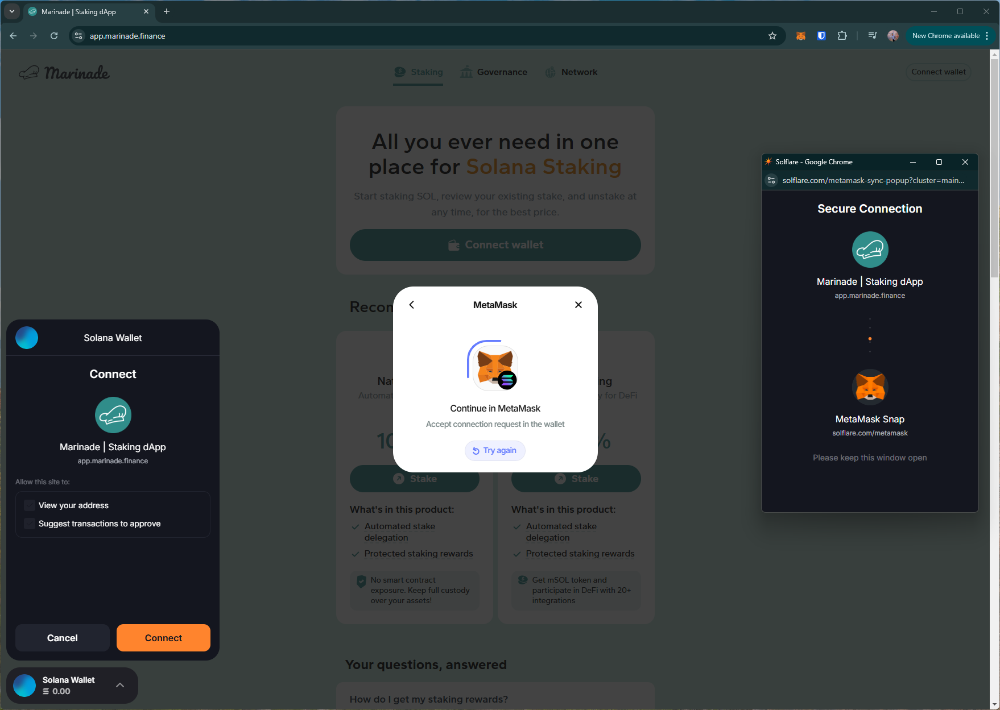
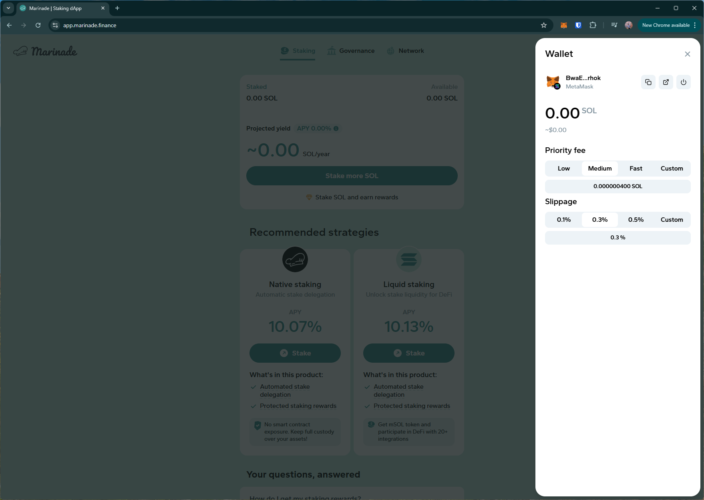

# marinade
https://app.marinade.finance/

## Core Task 01

*Proceed to connect wallet to website with a practical mental model (G1-G3) of what connecting means, why the process is what it is (different web3 apps might use different processes), understanding and avoiding risks (G4-G5), and confirming connection is successful (G3) (via the website and via MetaMask).*

- connecting wallet triggers a new window requesting connecting to MetaMask snap for `Solana wallet` (analyzed in previous walkthrough)

## Core Task 02

*Configure wallet to connect to a desired blockchain network (if it is not already on this network). This network has to be supported by the DApp to perform transactions. The supported networks may be different on each DApp.* 

- No option to use on EVM networks.

## Core Task 03

*Conduct an operation of the web3 site that does require wallet approval, configure and sign the transaction, understand and avoid risks. Covers token balances, gas fees, approvals, signature, confirming transaction, etc.*

- No option to transact using EVM tokens.

## Core Task 04

*Revert, to the extent possible, any past interactions with the DApp. Disconnect the wallet, unapprove tokens, etc.* 

- Disconnect button does not disconnect from `Solana wallet` (possibly a site/snap bug).

## Screenshots
### MetaMask snap window

### disconnect
