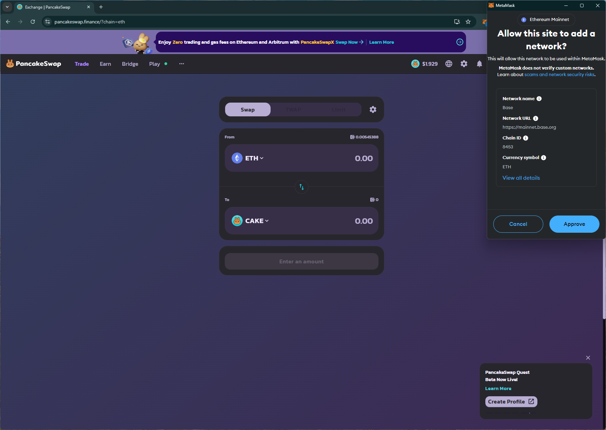
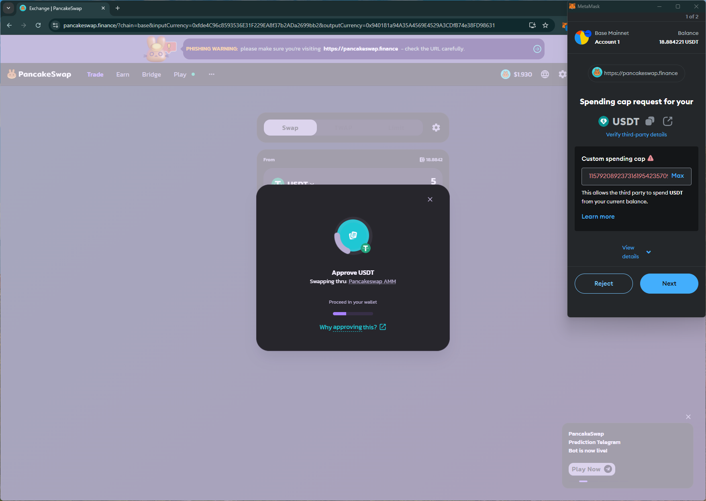
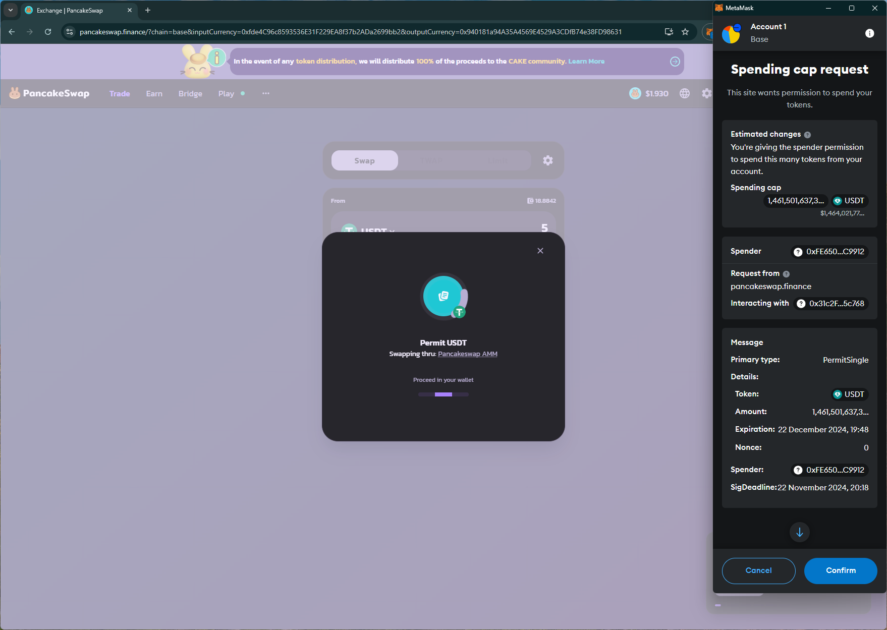
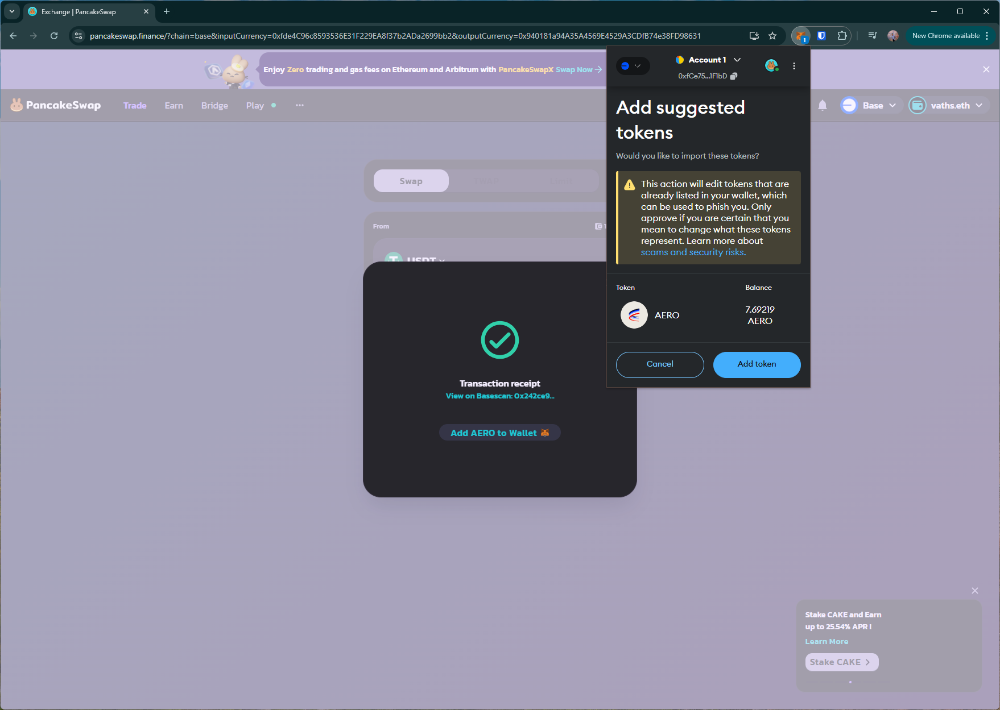

# pancakeswap
https://pancakeswap.finance/

## Core Task 01

*Proceed to connect wallet to website with a practical mental model (G1-G3) of what connecting means, why the process is what it is (different web3 apps might use different processes), understanding and avoiding risks (G4-G5), and confirming connection is successful (G3) (via the website and via MetaMask).*

- Simple option to connect. Shows the user's name tag after connecting.

## Core Task 02

*Configure wallet to connect to a desired blockchain network (if it is not already on this network). This network has to be supported by the DApp to perform transactions. The supported networks may be different on each DApp.* 

- Simple dropdown option to switch to a supported network.

## Core Task 03

*Conduct an operation of the web3 site that does require wallet approval, configure and sign the transaction, understand and avoid risks. Covers token balances, gas fees, approvals, signature, confirming transaction, etc.*

- Asks for unlimited approval during swap trx. Spending cap req uses a new layout (similar to previous dapp walkthroughs).

- Site shows "Add `AERO` to Wallet", triggering wallet prompt with a warning about updating the token in the wallet and points to https://support.metamask.io/managing-my-tokens/token-safety-practices/
    - while the wallet aims to warn about `airdrop scams`, it may be not be useful to warn immediately after the user has bought the token.

## Core Task 04

*Revert, to the extent possible, any past interactions with the DApp. Disconnect the wallet, unapprove tokens, etc.* 

- Disconnect is simple and removes site from the wallet

## Screenshots
### add network

### spending cap req (new layout)

### add token to wallet (warning)

