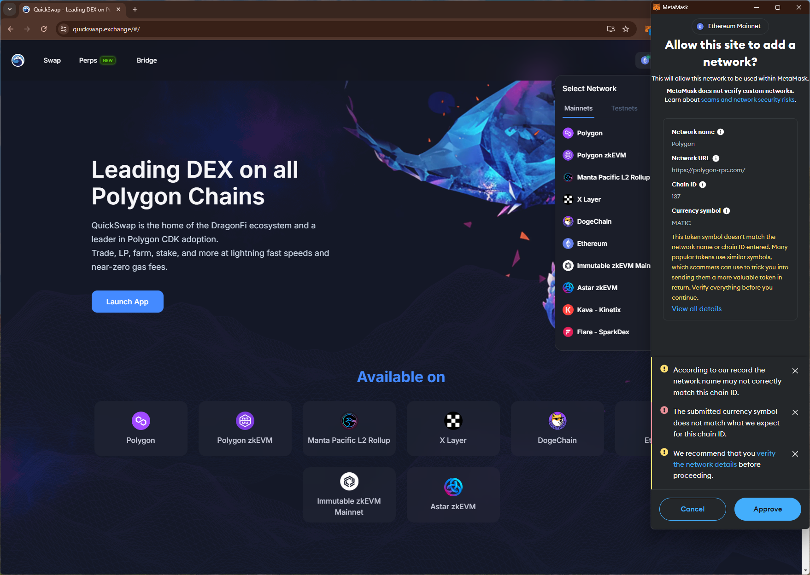
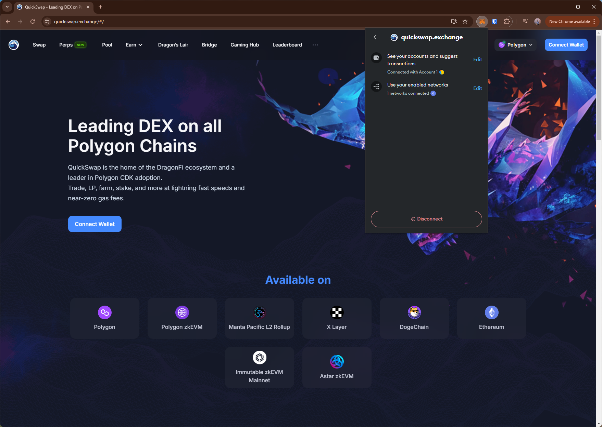

# quickswap
https://quickswap.exchange/

## Core Task 01

*Proceed to connect wallet to website with a practical mental model (G1-G3) of what connecting means, why the process is what it is (different web3 apps might use different processes), understanding and avoiding risks (G4-G5), and confirming connection is successful (G3) (via the website and via MetaMask).*

- Simple option to connect wallet. Shows (partial) wallet address as confirmation.

## Core Task 02

*Configure wallet to connect to a desired blockchain network (if it is not already on this network). This network has to be supported by the DApp to perform transactions. The supported networks may be different on each DApp.* 

- Simple dropdown option to switch to a supported network.

- Switching to `Polygon` network triggers multiple warnings. Approving the request does not result in switching the network (possibly an issue with the network/RPC).

## Core Task 03

*Conduct an operation of the web3 site that does require wallet approval, configure and sign the transaction, understand and avoid risks. Covers token balances, gas fees, approvals, signature, confirming transaction, etc.*

- Swap trx prompts for a spending cap request (trx amount).

- Confirms the trx after the swap.

T4. Revert, to the extent possible, any past interactions with the DApp. Disconnect the wallet, unapprove tokens, etc.

- Offers a toggle for "Infinite approval". Changing it does not show any confirmation (unclear if the approval has been revoked).

- Disconnect option doesn't disconnect site from the wallet (i.e., can reopen site and connect wallet without approving in the wallet)

## Screenshots
### add network

### disconnect doesn't remove site from the wallet
