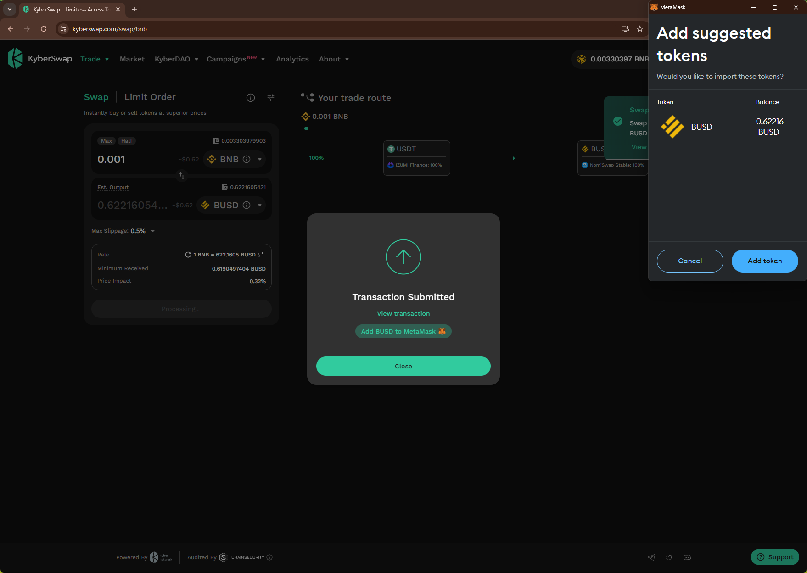

# kyberswap
https://kyberswap.com/

## Core Task 01

*Proceed to connect wallet to website with a practical mental model (G1-G3) of what connecting means, why the process is what it is (different web3 apps might use different processes), understanding and avoiding risks (G4-G5), and confirming connection is successful (G3) (via the website and via MetaMask).*

- Simple option to connect wallet. Shows the user's name tag and wallet balance.

## Core Task 02

*Configure wallet to connect to a desired blockchain network (if it is not already on this network). This network has to be supported by the DApp to perform transactions. The supported networks may be different on each DApp.* 

- Simple prompt to select a supported network.

- Selecting `BNB Chain` triggers wallet prompt with multiple warnings.

## Core Task 03

*Conduct an operation of the web3 site that does require wallet approval, configure and sign the transaction, understand and avoid risks. Covers token balances, gas fees, approvals, signature, confirming transaction, etc.*

- after swp trx, the site shows an option to "add BUSD to MetaMask"

## Core Task 04

*Revert, to the extent possible, any past interactions with the DApp. Disconnect the wallet, unapprove tokens, etc.* 

- Disconnect option is simple and removes site from the wallet.

## Screenshots
### add network warnings

### add token to wallet
