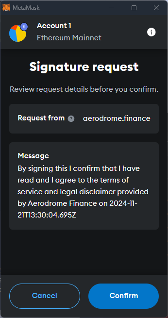
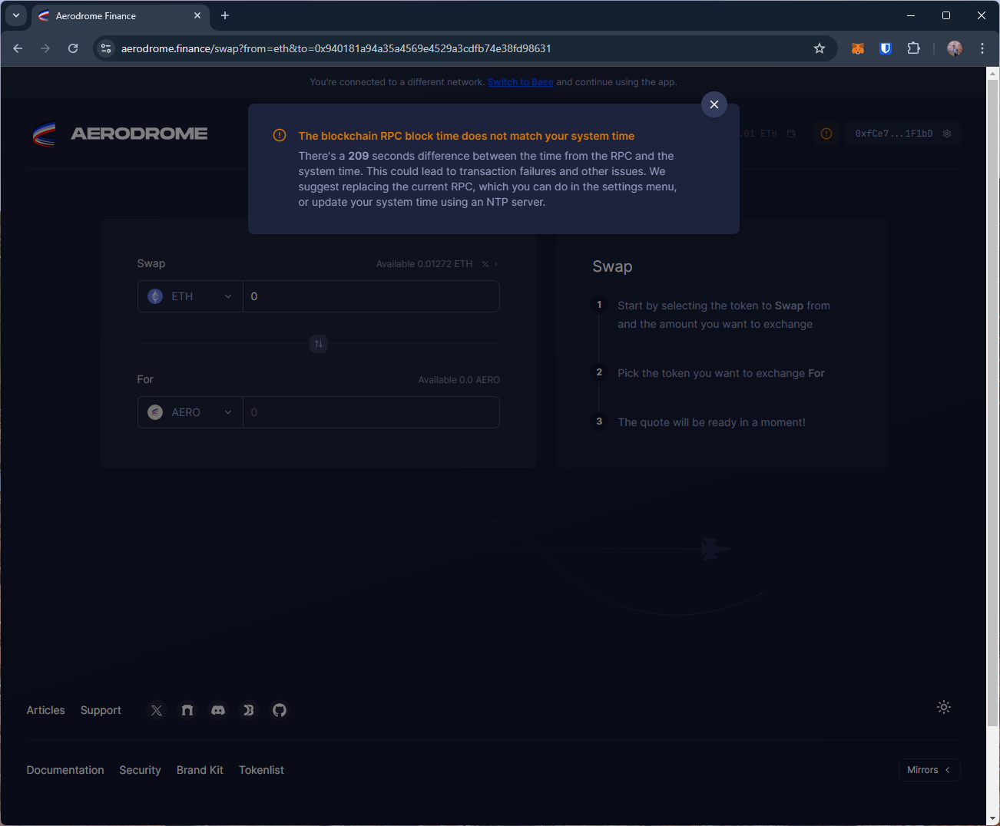
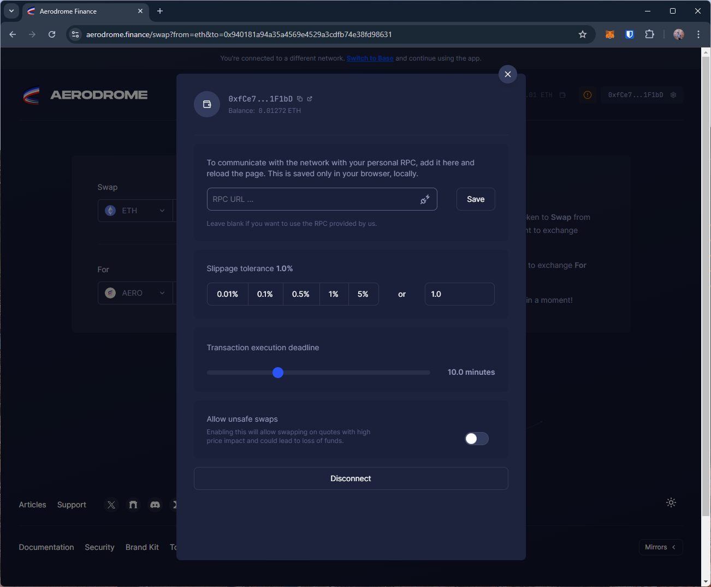

# aerodrome
https://aerodrome.finance/

T1. Proceed to connect wallet to website with a practical mental model (G1-G3) of what connecting means, why the process is what it is (different web3 apps might use different processes), understanding and avoiding risks (G4-G5), and confirming connection is successful (G3) (via the website and via MetaMask).

- The site uses "Browser wallet" to refer to MetaMask (installed wallet). This may be confusing for some users, slightly violating G2.

- After connecting, the site shows the "Sign-in" button, prompting the user to agree to their legal disclaimer. This may not be familiar to many users as it is not a common approach in DApps, affecting G6-G7.

T2. Configure wallet to connect to a desired blockchain network (start from mainnet Ethereum). This network has to be supported by the DApp to perform transactions. The supported networks may be different on each DApp.

- After connecting, the site shows a warning about a clock time mismatch between the system and RPC, and suggests 'fixing' the system time by using a "NTP server" or using a different RPC. Users cannot be expected to understand these technical details, violating G2 and G6.

- The site offers an option to use a "personal RPC" server. While this is useful, it may be better if it showed the default RPC (G8) and offered information about its privacy and security to improve G5.

T3. Conduct an operation of the web3 site that does require wallet approval, configure and sign the transaction, understand and avoid risks. Covers token balances, gas fees, approvals, signature, confirming transaction, etc.

- The site notifies that the transaction was successfull, yet it doesn't update the displayed wallet balance, impacting G3.

T4. Revert, to the extent possible, any past interactions with the DApp. Disconnect the wallet, unapprove tokens, etc. 

- Disconnect option is simple.

## Screenshots
### connect wallet and sign-in

### network/rpc

