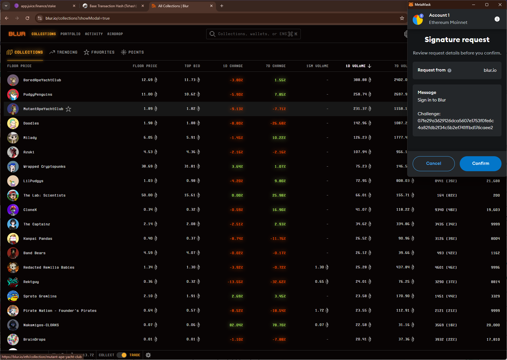
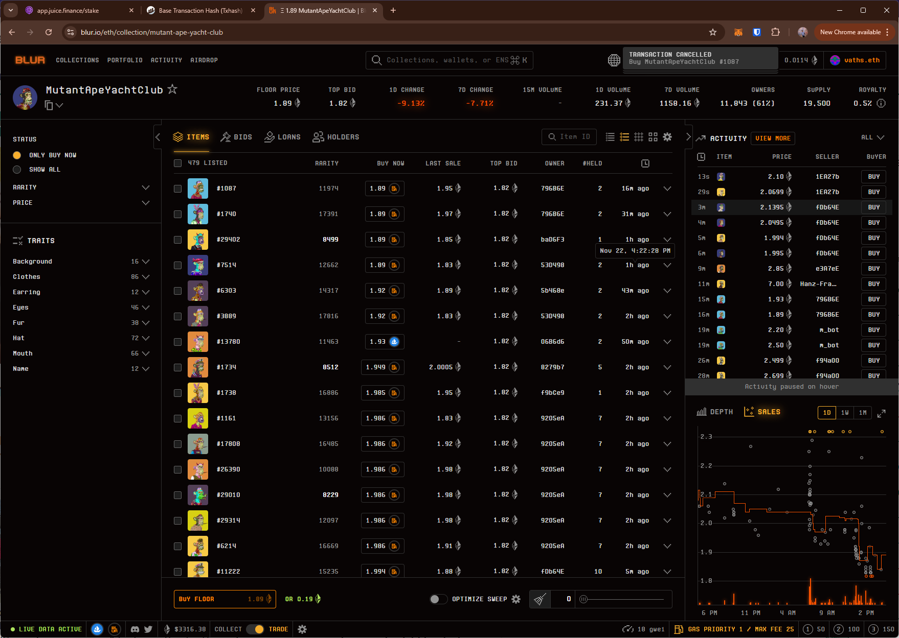
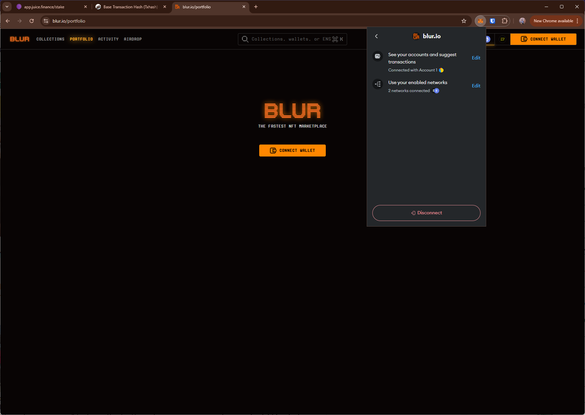

# blur
# https://blur.io/

T1. Proceed to connect wallet to website with a practical mental model (G1-G3) of what connecting means, why the process is what it is (different web3 apps might use different processes), understanding and avoiding risks (G4-G5), and confirming connection is successful (G3) (via the website and via MetaMask).

- connect wallet asks the user to sign a "sign in to Blur" prompt. Unclear what this does besides connecting the wallet.

T2. Configure wallet to connect to a desired blockchain network (start from mainnet Ethereum). This network has to be supported by the DApp to perform transactions. The supported networks may be different on each DApp.

- selecting `Blast` network from the site re-triggers the "sign in to Blur" prompt in the wallet. Duplicate prompts such as these without explanation hurts G6-G8.

T3. Conduct an operation of the web3 site that does require wallet approval, configure and sign the transaction, understand and avoid risks. Covers token balances, gas fees, approvals, signature, confirming transaction, etc.

- Attempts to transact fails without sufficient details.

T4. Revert, to the extent possible, any past interactions with the DApp. Disconnect the wallet, unapprove tokens, etc. 

- Disconnect option doesn't disconnect site from the wallet (i.e., can reopen site and connect wallet without approving in the wallet)

## Screenshots
### "sign in to Blur" request

### transaction attempt

### disconnect doesn't remove site from the wallet
