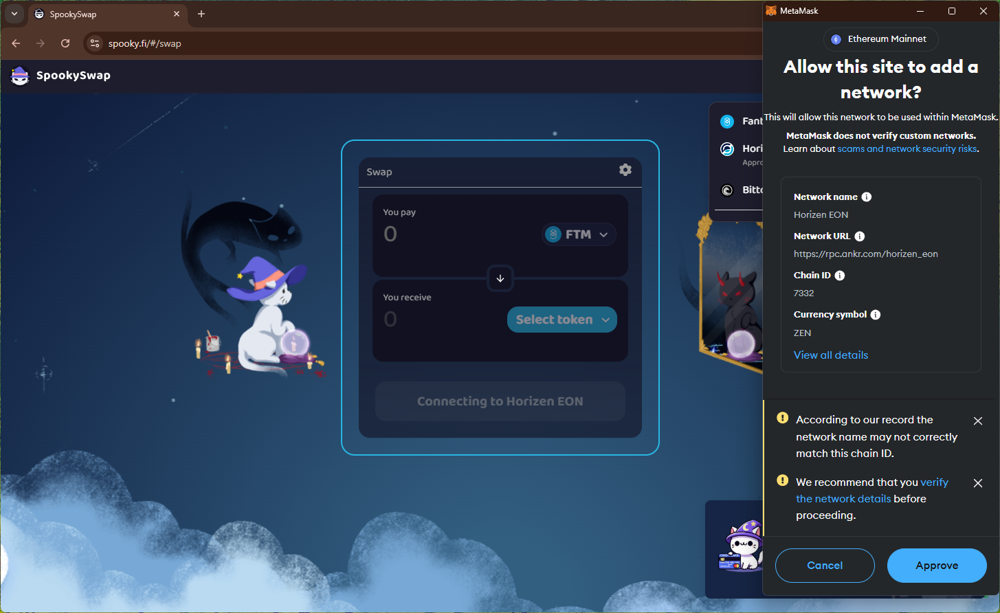
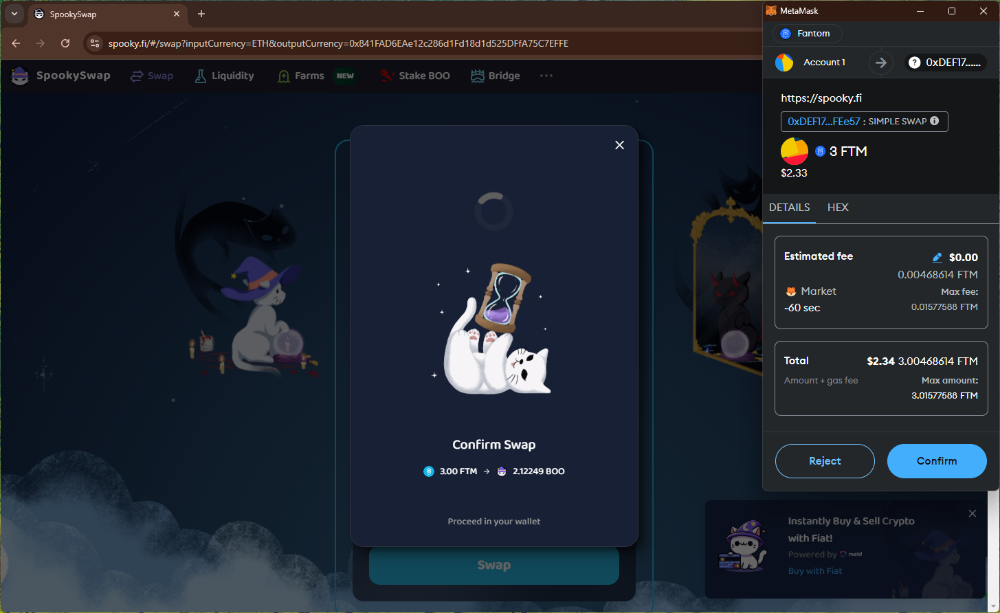
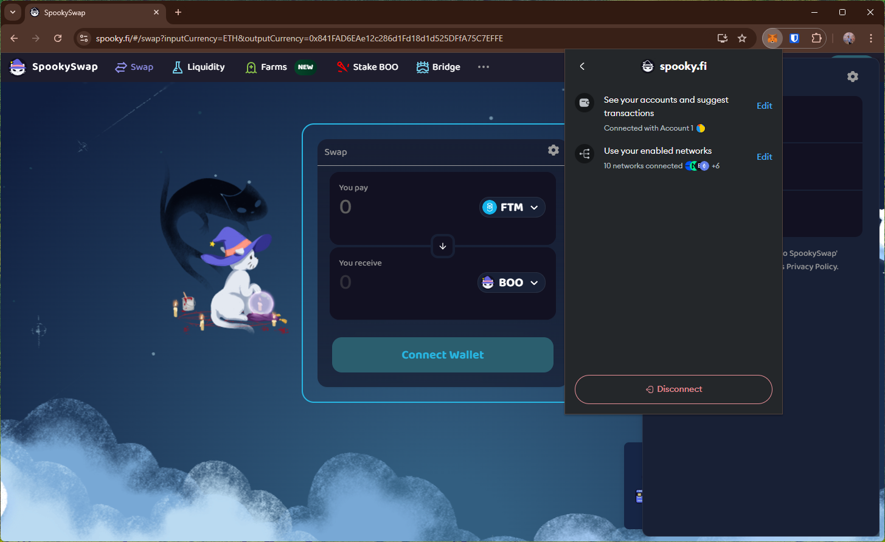

# spooky
https://spooky.fi/

## Core Task 01

*Proceed to connect wallet to website with a practical mental model (G1-G3) of what connecting means, why the process is what it is (different web3 apps might use different processes), understanding and avoiding risks (G4-G5), and confirming connection is successful (G3) (via the website and via MetaMask).*

- Simple option to connect wallet. Shows (partial) wallet address after connecting.

## Core Task 02

*Configure wallet to connect to a desired blockchain network (if it is not already on this network). This network has to be supported by the DApp to perform transactions. The supported networks may be different on each DApp.* 

- Selecting `Connect to Ethereum` button opens wallet prompt that refers to another network (`Fantom`) not Ethereum.

## Core Task 03

*Conduct an operation of the web3 site that does require wallet approval, configure and sign the transaction, understand and avoid risks. Covers token balances, gas fees, approvals, signature, confirming transaction, etc.*

- Bridge option directs to another website (`Squidrouter` exchange).
    - spending cap request only for the trx amount.
    - wallet predictions only includes send amount
    - disconnect option removes site from the wallet.

- trx prompt only shows fees.

## Core Task 04

*Revert, to the extent possible, any past interactions with the DApp. Disconnect the wallet, unapprove tokens, etc.* 

- Disconnect option doesn't disconnect site from the wallet (i.e., can reopen site and connect wallet without approving in the wallet)

## Screenshots
### add network

### swap trx

### disconnect doesn't remove site from the wallet
