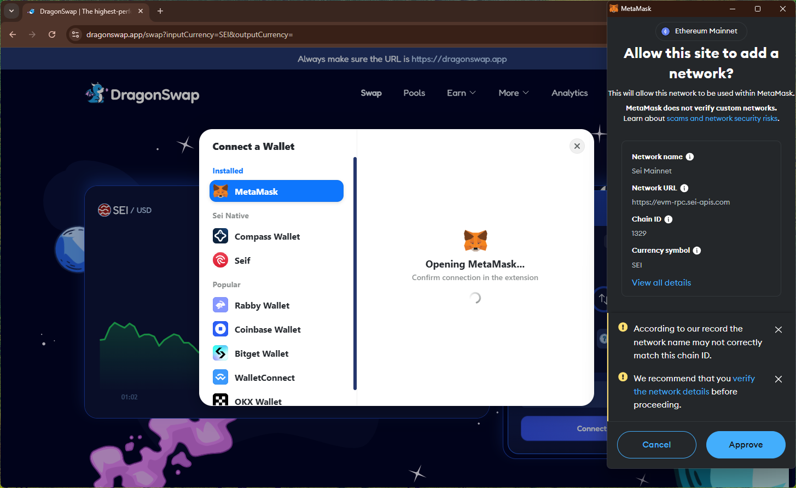
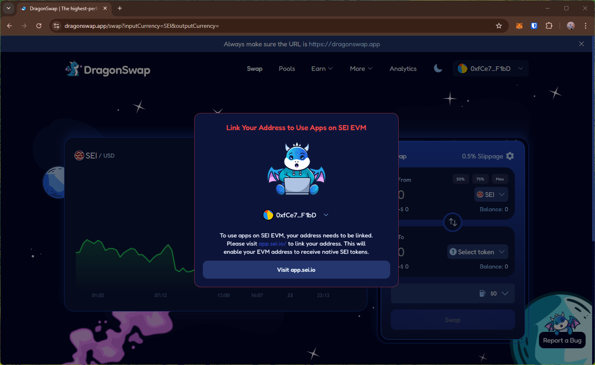
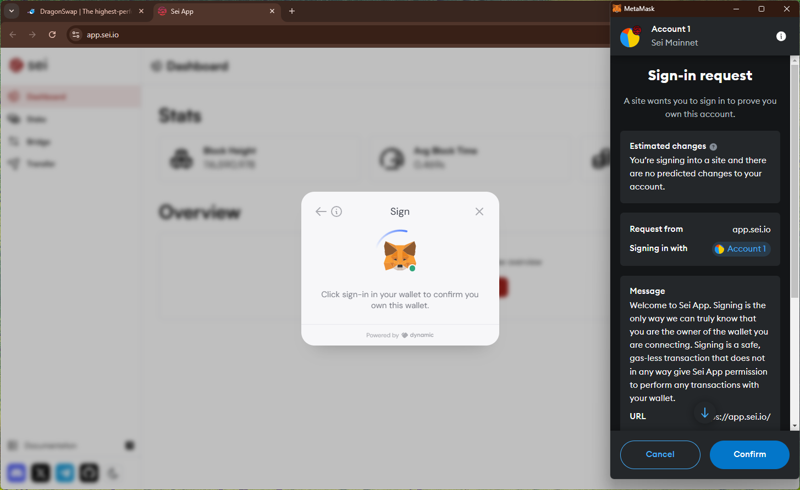

# dragonswap
https://dragonswap.app/

## Core Task 01

*Proceed to connect wallet to website with a practical mental model (G1-G3) of what connecting means, why the process is what it is (different web3 apps might use different processes), understanding and avoiding risks (G4-G5), and confirming connection is successful (G3) (via the website and via MetaMask).*

- Connecting to wallet immediately triggers network switch to `Sei Mainnet`. 

- Prompts to link EVM address (on a different site) to continue after connecting wallet

## Core Task 02

*Configure wallet to connect to a desired blockchain network (if it is not already on this network). This network has to be supported by the DApp to perform transactions. The supported networks may be different on each DApp.* 

- new site asks to sign a message for signing in.

- link operation triggers a wallet prompt asking to `associate` an arbitrary number without any description (affects G6-G7).
    - No info provided about the implications/necessity of linking addresses.

## Core Task 03

*Conduct an operation of the web3 site that does require wallet approval, configure and sign the transaction, understand and avoid risks. Covers token balances, gas fees, approvals, signature, confirming transaction, etc.*

## Core Task 04

*Revert, to the extent possible, any past interactions with the DApp. Disconnect the wallet, unapprove tokens, etc.* 

- Disconnect button (in the main site) removes site from the wallet. 

- Disconnect button on the new site doesn't appear to change anything.

## Screenshots
### add network req after connect

### prompt to link EVM address

