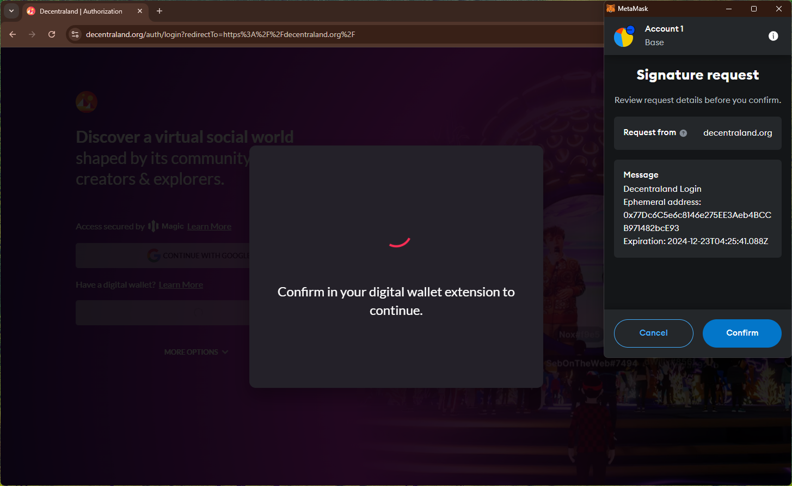
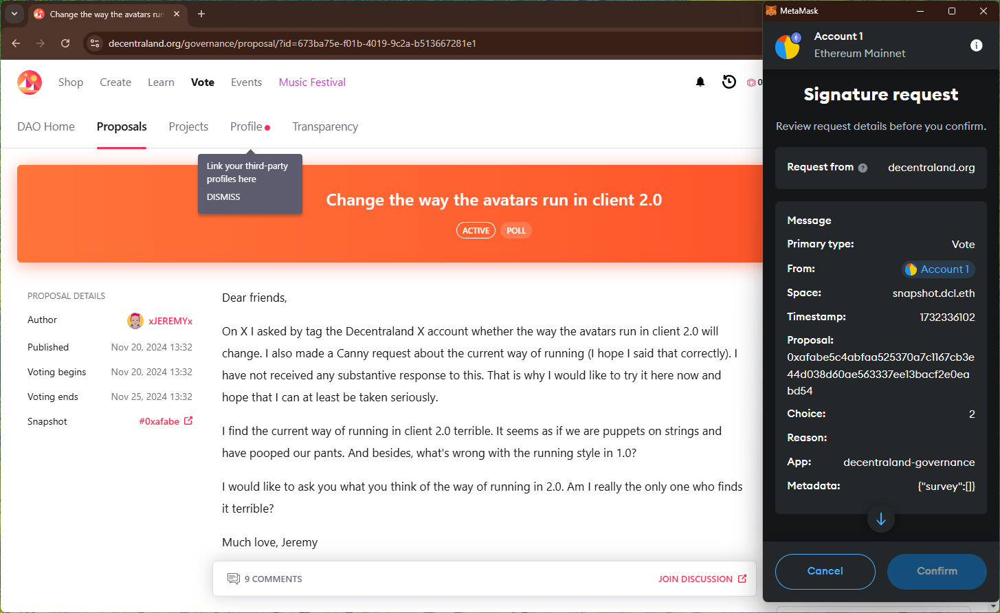
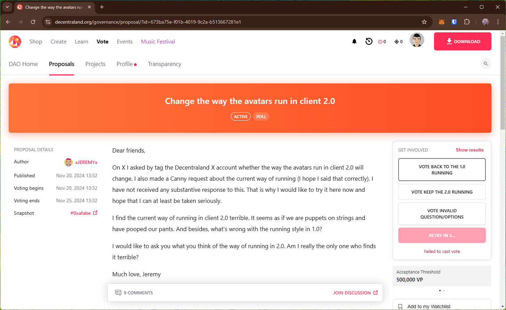
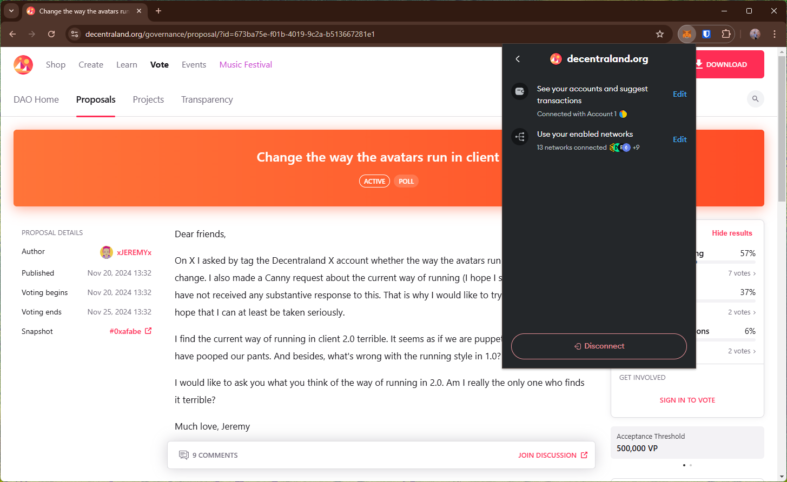

# decentraland
https://decentraland.org/

## Core Task 01

*Proceed to connect wallet to website with a practical mental model (G1-G3) of what connecting means, why the process is what it is (different web3 apps might use different processes), understanding and avoiding risks (G4-G5), and confirming connection is successful (G3) (via the website and via MetaMask).*

- Connecting wallet immediately triggers a `signature request` with an "ephemeral address". Unclear why this is requested (affecting G1-G2)

## Core Task 02

*Configure wallet to connect to a desired blockchain network (if it is not already on this network). This network has to be supported by the DApp to perform transactions. The supported networks may be different on each DApp.* 

- Only supports Ethereum network

## Core Task 03

*Conduct an operation of the web3 site that does require wallet approval, configure and sign the transaction, understand and avoid risks. Covers token balances, gas fees, approvals, signature, confirming transaction, etc.*

- DAO voting trx triggers signature request with info about the vote. This prompt only shows numerical values (e.g., vote choice is "2") which affects comprehensibility (G6-G8).
    - Better design might be to augment the wallet with actual vote entry (e.g., supplementing with dapp provided description in the wallet API)
    - trx fails without any info/remediation steps.

## Core Task 04

*Revert, to the extent possible, any past interactions with the DApp. Disconnect the wallet, unapprove tokens, etc.* 

- Disconnect option doesn't disconnect site from the wallet (i.e., can reopen site and connect wallet without approving in the wallet)

## Screenshots
### connect wallet

### DAO vote signing req

### disconnect doesn't remove site from the wallet
