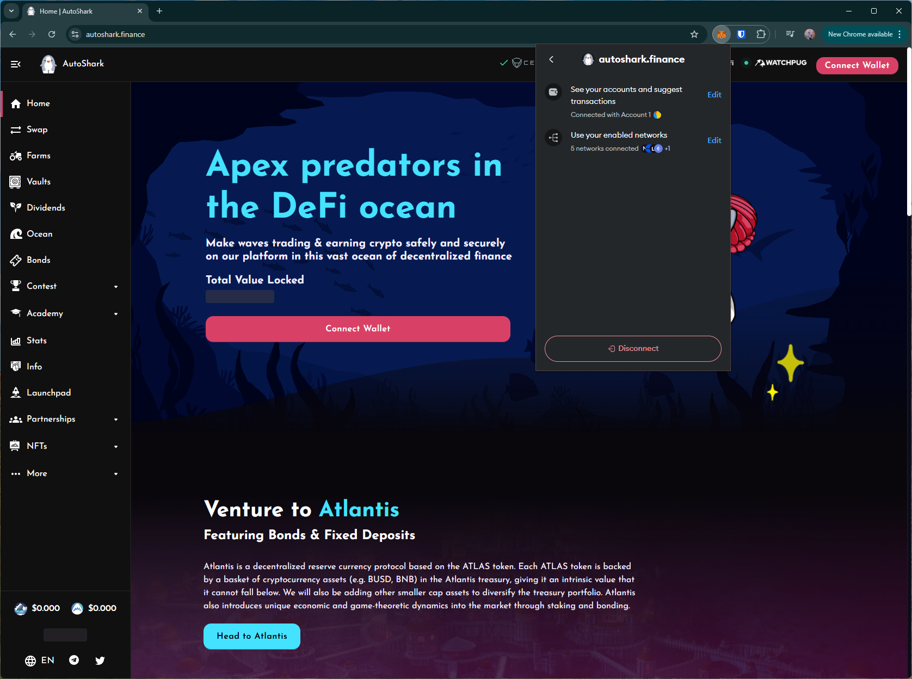

# autoshark
https://autoshark.finance/

## Core Task 01

*Proceed to connect wallet to website with a practical mental model (G1-G3) of what connecting means, why the process is what it is (different web3 apps might use different processes), understanding and avoiding risks (G4-G5), and confirming connection is successful (G3) (via the website and via MetaMask).*

- Loading the site immediately triggers a wallet prompt to change the network (T2). This assumes the user has decided to use their wallet with the site by just visiting it. It's also not clear if the site can be used without changing to this network. This affects users' understanding about connecting to the site (G1-G3). 

## Core Task 02

*Configure wallet to connect to a desired blockchain network (if it is not already on this network). This network has to be supported by the DApp to perform transactions. The supported networks may be different on each DApp.* 

- It's not clear if the site only supports BNB chain as there is no option to change network on the site (G1).

## Core Task 03

*Conduct an operation of the web3 site that does require wallet approval, configure and sign the transaction, understand and avoid risks. Covers token balances, gas fees, approvals, signature, confirming transaction, etc.*

- Contract name in the transaction prompt is vague and does not explain the action to the user. While this is longer than other DApps, a more clear and simple name can help improve comprehensibility (G6-G8).

## Core Task 04

*Revert, to the extent possible, any past interactions with the DApp. Disconnect the wallet, unapprove tokens, etc.*  

- Disconnect option doesn't disconnect site from the wallet (i.e., can reopen site and connect wallet without approving in the wallet)

## Screenshots
### landing page prompt

### contract name in trx prompt

### disconnect doesn't remove the site from the wallet

