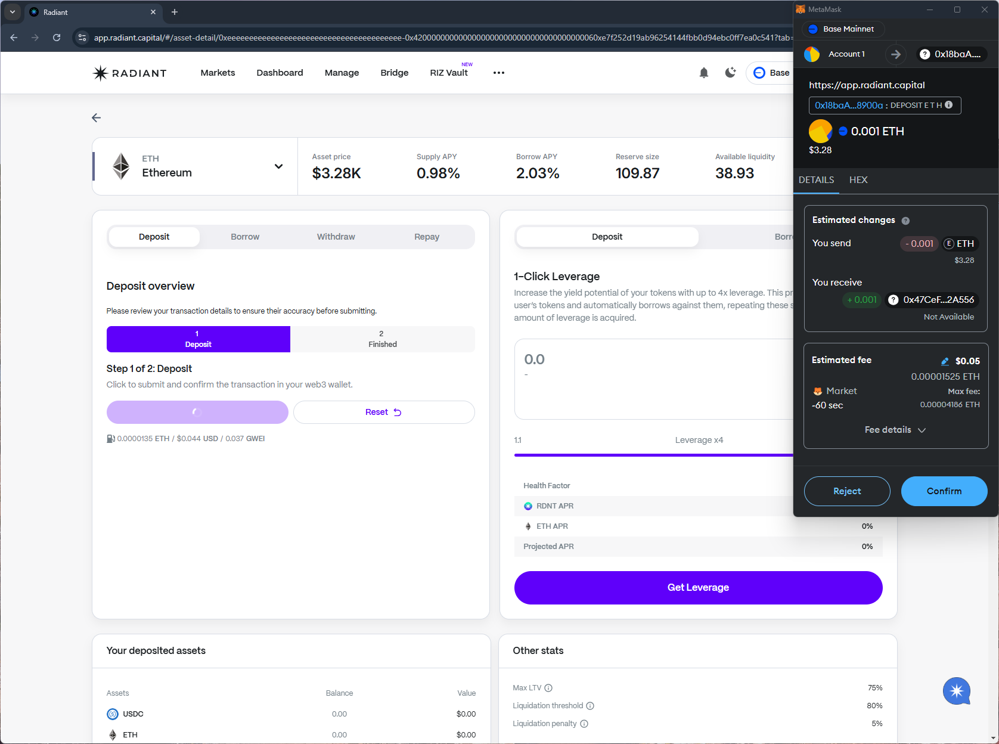
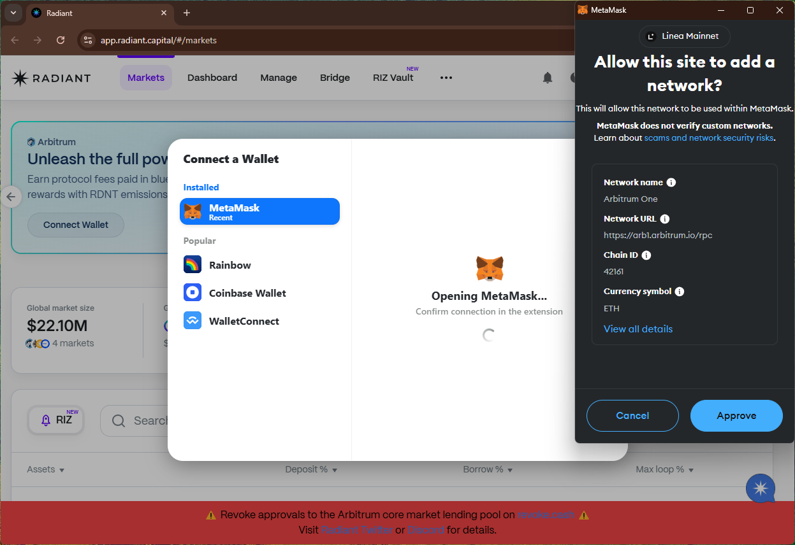
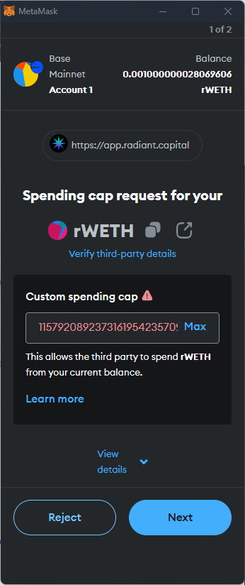

# radiant
https://app.radiant.capital/

## Core Task 01

*Proceed to connect wallet to website with a practical mental model (G1-G3) of what connecting means, why the process is what it is (different web3 apps might use different processes), understanding and avoiding risks (G4-G5), and confirming connection is successful (G3) (via the website and via MetaMask).*

- Connect wallet option is simple, and shows the (partial) wallet address confirming connection was successful.

## Core Task 02

*Configure wallet to connect to a desired blockchain network (if it is not already on this network). This network has to be supported by the DApp to perform transactions. The supported networks may be different on each DApp.* 

- Simple dropdown option on the site to choose a supported network.

## Core Task 03

*Conduct an operation of the web3 site that does require wallet approval, configure and sign the transaction, understand and avoid risks. Covers token balances, gas fees, approvals, signature, confirming transaction, etc.*

- The estimated changes in the transaction prompt in MetaMask shows the receiving token's partial address along with "Not available" description. No explanation is provided about this, impacting comprehensibility about the expected risks/results (G6-G7). 

- Wallet balance on the site updates after the transaction is successful.

## Core Task 04

*Revert, to the extent possible, any past interactions with the DApp. Disconnect the wallet, unapprove tokens, etc.* 

- Withdrawing the token requests unlimited spending cap by default despite the req involving max balance. This means that future deposits may also be affected by this permission (G8).

- Disconnect option is simple and removes the site from the wallet

## Screenshots
### predicted changes

### add network

### withdraw deposit

