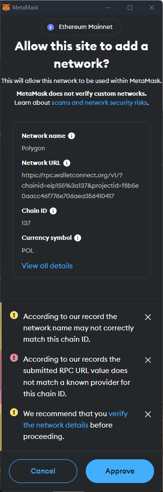
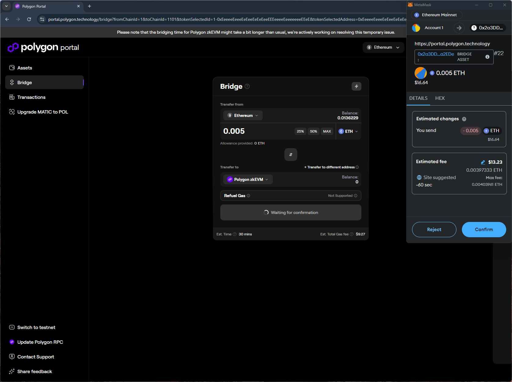

# polygon
https://portal.polygon.technology/

## Core Task 01

*Proceed to connect wallet to website with a practical mental model (G1-G3) of what connecting means, why the process is what it is (different web3 apps might use different processes), understanding and avoiding risks (G4-G5), and confirming connection is successful (G3) (via the website and via MetaMask).*

- Connect wallet option is simple. Shows the (partial) wallet address and the balance after connection is successful.

## Core Task 02

*Configure wallet to connect to a desired blockchain network (if it is not already on this network). This network has to be supported by the DApp to perform transactions. The supported networks may be different on each DApp.* 

- MetaMask prompt after selecting the Polygon network warns about specified RPC URL not matching its records. It's not clear if the mistmatch is because of the domain or the parameters included in the URL. This distinction may be important for understanding the security implications.

## Core Task 03

*Conduct an operation of the web3 site that does require wallet approval, configure and sign the transaction, understand and avoid risks. Covers token balances, gas fees, approvals, signature, confirming transaction, etc.*

- When bridging ETH to Polygon zkEVM on the site:
    - shows the allowance provided as 0 (supports G8)
    - wallet's estimated changes only includes send amount. Unclear if receive could not be estimated or it is not expected.
    - shows expected time for the transaction to complete (~30 mins)

## Core Task 04

*Revert, to the extent possible, any past interactions with the DApp. Disconnect the wallet, unapprove tokens, etc.* 

- Disconnect option is simple and removes the site from the wallet

## Screenshots
### unknown RPC provider warnings

### bridge asset
