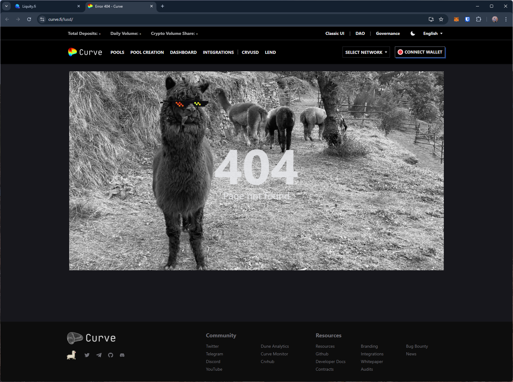
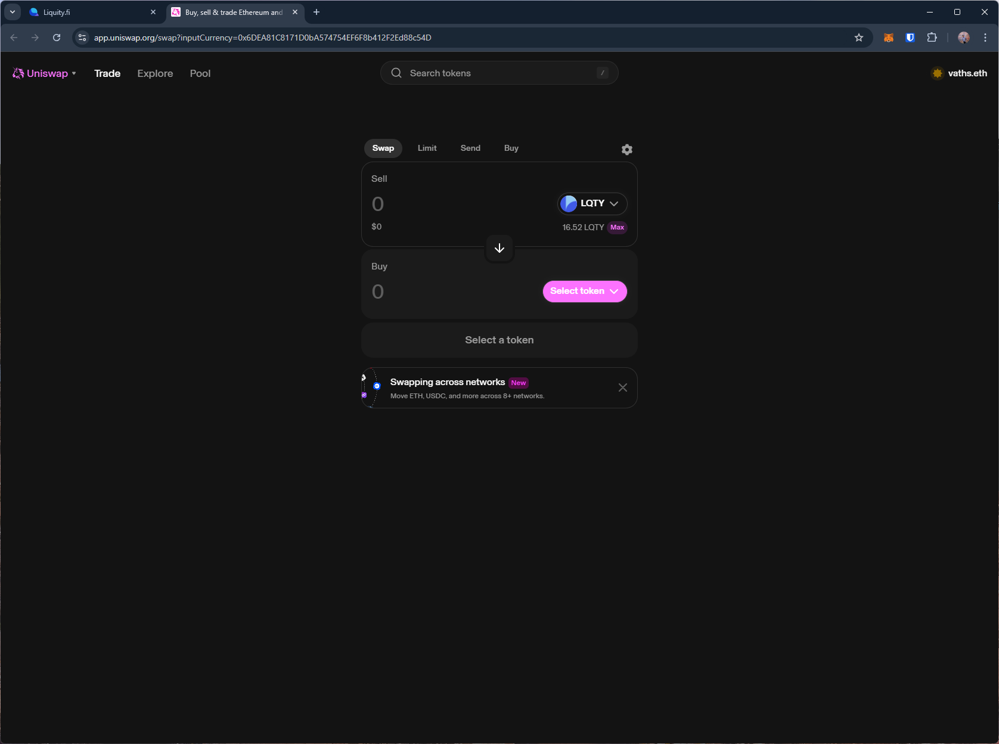
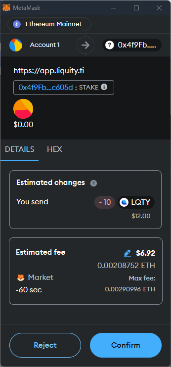
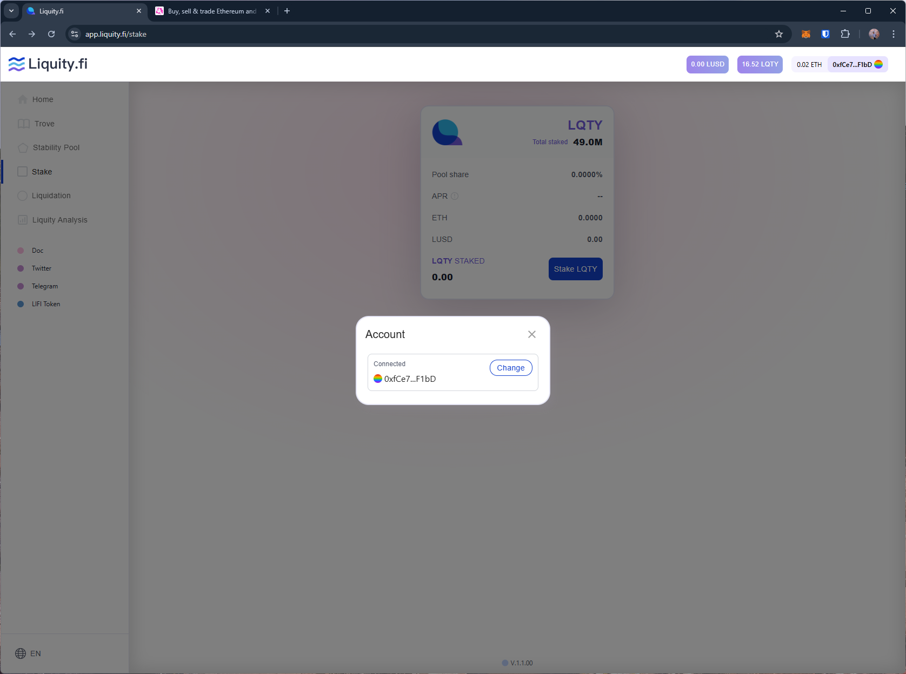

# liquity
https://app.liquity.fi/

T1. Proceed to connect wallet to website with a practical mental model (G1-G3) of what connecting means, why the process is what it is (different web3 apps might use different processes), understanding and avoiding risks (G4-G5), and confirming connection is successful (G3) (via the website and via MetaMask).

- Connect wallet option is simple. Shows the (partial) wallet address and the balance after connection is successful.

T2. Configure wallet to connect to a desired blockchain network (start from mainnet Ethereum). This network has to be supported by the DApp to perform transactions. The supported networks may be different on each DApp.

- Unclear if the site only supports Ethereum Mainnet as there is no option to change network on the site (G1).

T3. Conduct an operation of the web3 site that does require wallet approval, configure and sign the transaction, understand and avoid risks. Covers token balances, gas fees, approvals, signature, confirming transaction, etc.

- The site operates using its native tokens and provides options to buy tokens by directing users to other platforms.
    - selecting to buy LUSD directs to curve.fi which shows 404 error page and no instructions on proceeding (G2).
    - selecting to buy LQTY directs to uniswap.

T4. Revert, to the extent possible, any past interactions with the DApp. Disconnect the wallet, unapprove tokens, etc. 

- No disconnect option on the dapp. Only "change" wallet option is displayed.

## Screenshots
### buy native tokens

### stake trx request

### no disconnect option

