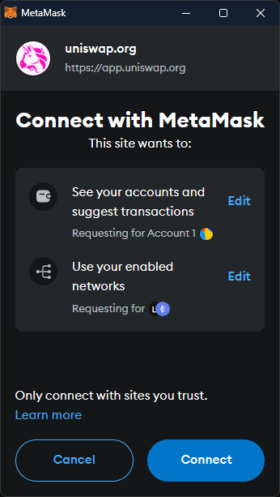
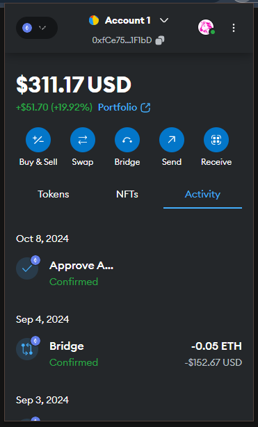
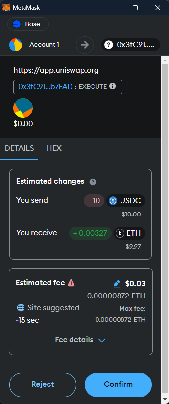
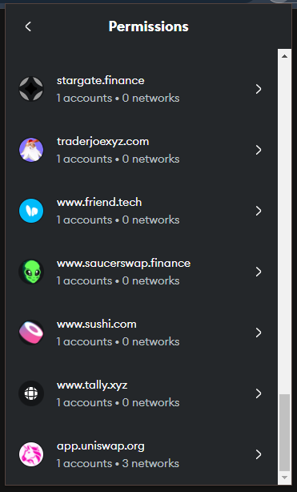
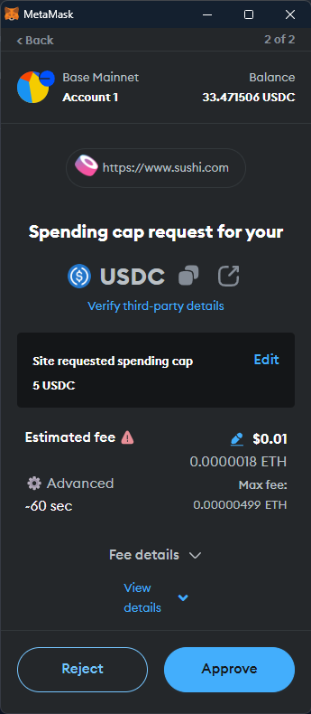
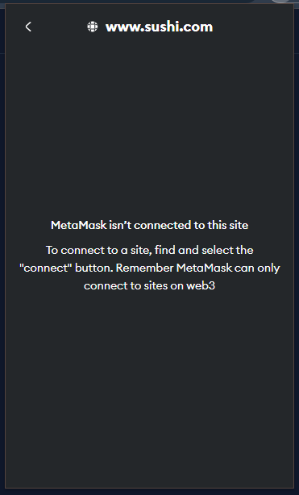
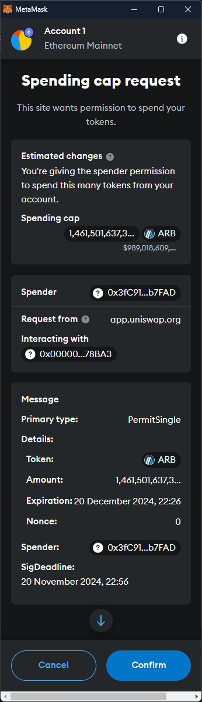
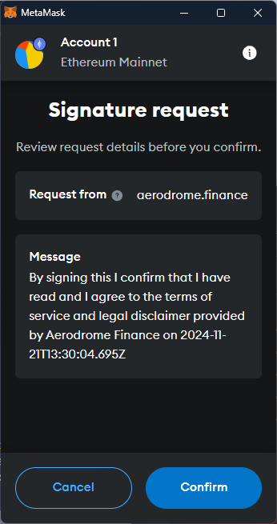

# List of Top 50 DApps

Start with top 50 DApps listed on `DAppradar.com`, ranked by the total value of assets held under the DApp’s contract over a 30-day period (Nov 2025).
- Skip DApp if it does not show an option to connect with a wallet (e.g., informational websites).
- Skip DApp if it does not support the MetaMask wallet

> Reviewed 70 DApps in total - 50 met the criteria, 10 did not offer MetaMask (but supports another wallet), and remaining 10 included websites that were informational, duplicates, or blocked.

## Notes during walkthroughs

| Option/issue                   | instances  |
| :----------------------------- | ---------: |
||                      ***DAPP INDICATORS*** |
| dapps showing connected wallet | 33/34      |
| add ntw prompts w "this site"  | 31/31      |
| MetaMask cues indicating site  | 9          |
||                       ***SWITCH NETWORK*** |
| add ntw prmpts w yllw cautions |  9/14      |
| add ntw prmpts w red warnings  |  5/14      |
| explicit swt ntw optn on dapp  | 23/27      |
| ~~ difficult to find           | 3/27       |
||                    ***PREDICTED CHANGES*** |
| trxs with wallet's predictions | 26/30      |
| ~~ shows est only for send     | 6/30       |
||                            ***APPROVALS*** |
| dapps asking unlmt approvals   | 16/23      |
| ~~ can't restrict on dapp      | 23/23      |
| ~~ show x but ask xx amount    | 0/23       |
||                           ***DISCONNECT*** |
| dapp option to disconnect      | 28/31      |
| ~~ no opt to revoke unlmt appv |  /         |
| ~~ doesn't disconnect from MM  | 16/31      |

TODO: count add ntw prmpts w yllw/red for the first 20 sites.

## Top 50
1. https://app.uniswap.org/
2. https://www.sushi.com/
3. https://phoenix.chaincolosseum.org/
4. https://aerodrome.finance/
5. https://autoshark.finance/
6. https://app.radiant.capital/
7. https://portal.polygon.technology/
8. https://app.liquity.fi/
9. https://ambient.finance/
10. https://app.ether.fi/
11. https://solend.fi/
12. https://vvs.finance/
13. https://stargate.finance/
14. https://app.morpho.org/
15. https://app.burrow.finance/
16. https://app.compound.finance/
17. https://tectonic.finance/
18. https://app.colend.xyz/
19. https://app.gmx.io/
20. https://app.sablier.com/
21. https://app.yei.finance/
22. https://app.avalonfinance.xyz/
23. https://curve.fi/
24. https://www.saucerswap.finance/
25. 
26. https://app.ref.finance/
27. https://balancer.fi/
28. https://moonwell.fi/
29. https://ring.exchange/
30. https://app.alienbase.xyz/
31. https://app.vertexprotocol.com/
32. https://lfj.gg/
33. https://app.marinade.finance/
34. https://pancakeswap.finance/
35. https://quickswap.exchange/
36. https://kyberswap.com/
37. https://fluid.instadapp.io/
38. https://app.juice.finance/
39. https://fi.woo.org/
40. https://blur.io/
41. https://camelot.exchange/
42. https://karak.network/
43. https://carv.io/
44. https://spooky.fi/
45. https://neopin.io/
46. https://dragonswap.app/
47. https://klayswap.com/en
48. https://icecreamswap.com/
49. https://decentraland.org/
50. https://www.lynex.fi/

## Do not support MetaMask (but offer other options):
- https://justlend.org/
- https://app.roninchain.com/
- https://sun.io/
- https://nostra.finance/
- https://sweateconomy.com/
- https://ston.fi/
- https://dedust.io/
- https://fragment.com/
- https://saberdao.io/
- https://zklend.com/

## Screenshots for various cues/indicators about DApp site in MetaMask

